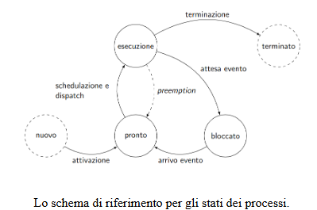

# Descrizione Processi

Vediamo di preciso cosa si intende nell'avere un contesto diverso per ogni processo.

Il contesto non è altro una struttura dati salvata in M2, ed è formato da:

- id : descrittore processo
- corpo: contenuto dei registri del processore
- priorità: indica il livello di priorità del processo

Sappiamo già che il processore lavora per stati. Anche i processi seguono la stessa logica e, durante la loro vita, si trovano costantemente in uno degli stati di esecuzione:



I processi devono essere prima di tutto attivati (ovvero devono essere create tutte le strutture dati che servono a farlo funzionare), in modo che possano cominciare ad essere eseguiti.Le struttore di ogni processo comprendono il __Descrittore di processo__ e le __Pile__.

In alcuni sistemi i processi da attivare sono decisi staticamente all’avvio del sistema. Nel nostro, descriveremo il caso in cui i processi possano essere creati dinamicamente da altri processi (tranne ovviamente il primo processo, che sarà creato dal sistema stesso all’avvio).

Una volta attivato correttamente, il processo si trova nello stato di pronto, nel nostro sistema questa lista è rappresentata dalla lista `pronti`. A questo punto, il processore, tramite _la schedulazione e il dispatch_, porta il processo in __esecuzione__, nel nostro sistema rappresentata dalla variabile `esecuzione`.

Schedulazione e Dispatch sono due cose diverse:

- __La schedulazione__ $\rightarrow$ gestisce l’ordine dei _processi pronti_ all’interno della lista (`pronti`), scegliendo quello che andrà in _esecuzione_. La funzione `sistema` chiamata `schedulatore()` che si occupa proprio di selezionare la testa della lista `pronti` (costruita in modo da essere ordinata per priorità) e inserirla in `esecuzione`.
- __Il dispatch__ $\rightarrow$ si occupa di tutti i passaggi necessari per far cedere il controllo ad un processo ed assegnarlo ad un altro. Nel nostro sistema questa avviene tramite le operazioni di:

```assembly
CALL carica_stato
IRETQ
```

(In `sistema.s`)

Chiamate all’uscita del gate. Infatti queste fanno adesso riferimento al constesto del processo che si trova in `esecuzione`, aggiornando quindi i dati all’interno dei registri con quelli del nuovo processo.

Se un processo si trova nello stato di `esecuzione`, il processore sta eseguendo le __sue__ istruzioni. In questo momento __il processo ha il controllo__ del _processore_, e può cambiare nel tempo il suo stato. __Con un solo processore un solo processo per volta può trovarsi in esecuzione__.

Mentre si trova in esecuzione un processo può fare 2 cose: 

- chiedere di terminare:
  - chiamo  `terminate_p()`
  - il processo rientra nello stato di terminazione
- chiedere di sospendersi in attesa di un evento.  
  - passa allo stato bloccato. Mentre un processo è bloccato il processore prosegue con un’altro nella coda pronti. 
  - Quando l’evento atteso si verifica il processo torna nello stato di pronto (può anche accadere che vada direttamente in esecuzione, anche se ciò non è mostrato esplicitamente in figura)

Nello schema si trova anche la _preemption_, che permette ad un processo di passare dall’`esecuzione` direttamente allo stato `pronto`.

In questo caso il processo non sta attendendo un evento, non è più in esecuzione soltanto perchè un altro processo, per un motivo o per un altro (ad esempio priorità) sta occupando il processore durante quello che doveva essere il suo tempo. Nei sistemi senza preemption un processo può occupare il processore indefinitamente senza lasciare mai il processore agli altri processi, basta che non chieda mai di terminare, che non generi processi a priorità più elevata o che non vada mai nello stato di bloccato.

Per quanto riguarda lo scheduling esistono diverse strategie da poter seguire, quella vedremo noi è la strategia a priorità fissa. Secondo questa politica, ad ogni processo, al momento della creazione, è assegnata una priorità numerica. Il nostro sistema si impegna quindi a garantire che, in ogni istante, si trovi in esecuzione il processo che ha la massima priorità tra tutti quelli pronti.

Questo ci permette di dover eseguire una azione di schedulazione() solo quando un processo passa da:

esecuzione 
 bloccato: il processore si libera, e dunque dobbiamo mettere in esecuzione il processo a maggiore priorità tra quelli in pronti
bloccato 
 pronto: si genera quando c’è un nuovo processo pronto, che potrebbe avere priorità maggiore di quello attualmente in esecuzione. Per rispettare la regola che abbiamo promesso di garantire potremmo dover fare preemption sul processo in esecuzione.
Dobbiamo inoltre notare che anche quando un processo P1 ne attiva un altro P2 ci troviamo in una situazione simile, in quanto il nuovo processo appena creato viene inserito in pronti, e potrebbe avere priorità superiore a quello in esecuzione.

Quello che ci impegniamo a garantire quindi è che i processi non possano attivarne altri a priorità maggiore della propria. Perciò nel nostro sistema non saranno mai necessarie preemption dopo le creazioni dei processi.

# Passare da un processo all'altro

dobbiamo obbligatoriamente passare dalla idt; tramite le routine salva_stato e carica stato dispatchsalva e carica le varie 4

Lo scheduler, che invece identifica e ordina i processi pronti, utilizza un’altra variable globale pronti che punta ad una lista dove si trovano i vari processi nello stato di pronto. Poiché la nostra politica è quella di eseguire i processi a priorità maggiore, quando inseriamo i processi in questa lista, lo facciamo in ordine di priorità, cosicché il prossimo processo da eseguire sarà sempre quello in cima alla lista.

Per quanto riguarda la gestione dello stato bloccato vedremo che sarà necessario considerare ogni azione di bloccaggio in maniera diversa.

Le varie operazioni eseguite nel modulo sistema (come questa routine stessa), sono indipendenti dai processi, che si trovano come congelati durante questo frangente. (finché la prima cosa nella routine che facciamo è salvarne lo stato, e l’ultima cosa è caricarlo)

Quando entriamo nel gate da un processo P1 salviamo, tra le varie informazioni, l’indirizzo della pila utilizzata dal processo, nella sezione rsp della pila di sistema di P1. Facciamo ciò perché il registro rsp del processo in questo istante punta proprio alla pila di sistema di P1.

Quando eseguiamo quindi la salva_stato, il registro rsp punta proprio la pila di sistema P1 salvata dall’entrata al gate.

Ciò significa che, carica_stato ripristinerà la pila di sistema del processo P2, e la successiva IRETQ ripristinerà proprio le istruzioni relative a quel processo, reinserendo il valore della pila di stack di P2.

Tutto il necessario per cambiare processo è quindi cambiare la variabile esecuzione all’interno del corpo della routine.

Quando viene selezionato il prossimo processo però può avvenire che ci sia un solo processo in esecuzione e che questo vada in blocco. In questo caso la coda pronti è vuota, e dovremmo gestire il nostro processore in maniera che faccia comunque qualcosa in attesa il processo in blocco torni in pronti.

La strategia che adottiamo è quella di inserire un processo dummy con priorità più bassa di tutte (0), sempre presente in coda. Questo processo consiste in nient’altro che un in un ciclo infinito, che ha come obiettivo quello di attendere semplicemente che arrivi un nuovo processo significativo nello stato di pronto.

# Creazione processi

Lo scheduler, che invece identifica e ordina i processi pronti, utilizza un’altra variable globale pronti che punta ad una lista dove si trovano i vari processi nello stato di pronto. Poiché la nostra politica è quella di eseguire i processi a priorità maggiore, quando inseriamo i processi in questa lista, lo facciamo in ordine di priorità, cosicché il prossimo processo da eseguire sarà sempre quello in cima alla lista.

Per quanto riguarda la gestione dello stato bloccato vedremo che sarà necessario considerare ogni azione di bloccaggio in maniera diversa.

Le varie operazioni eseguite nel modulo sistema (come questa routine stessa), sono indipendenti dai processi, che si trovano come congelati durante questo frangente. (finché la prima cosa nella routine che facciamo è salvarne lo stato, e l’ultima cosa è caricarlo)

Quando entriamo nel gate da un processo P1 salviamo, tra le varie informazioni, l’indirizzo della pila utilizzata dal processo, nella sezione rsp della pila di sistema di P1. Facciamo ciò perché il registro rsp del processo in questo istante punta proprio alla pila di sistema di P1.

Quando eseguiamo quindi la salva_stato, il registro rsp punta proprio la pila di sistema P1 salvata dall’entrata al gate.

Ciò significa che, carica_stato ripristinerà la pila di sistema del processo P2, e la successiva IRETQ ripristinerà proprio le istruzioni relative a quel processo, reinserendo il valore della pila di stack di P2.

Tutto il necessario per cambiare processo è quindi cambiare la variabile esecuzione all’interno del corpo della routine.

Quando viene selezionato il prossimo processo però può avvenire che ci sia un solo processo in esecuzione e che questo vada in blocco. In questo caso la coda pronti è vuota, e dovremmo gestire il nostro processore in maniera che faccia comunque qualcosa in attesa il processo in blocco torni in pronti.

La strategia che adottiamo è quella di inserire un processo dummy con priorità più bassa di tutte (0), sempre presente in coda. Questo processo consiste in nient’altro che un in un ciclo infinito, che ha come obiettivo quello di attendere semplicemente che arrivi un nuovo processo significativo nello stato di pronto.

desc_proc

id: codice identificativo nella proc_table del processo

livello: LIV_UTENTE per tutti i processi che vogliamo possano essere chiamati ed eseguiti dall’utente.

precedenza: valore di prec passato da activate_p()

punt_nucleo: punta alla base pila di sistema, come se fosse vuota. Questo è necessario per gestire opportunamente le interruzioni quando il processo sarà in operazione a livello utente. Infatti, in questo caso, la sia pila sistema è sempre vuota.

contesto: contiene il valore dei registri al momento della creazione del processo, quindi sono tutti vuoti, ad eccezione di:

contesto[I_RDI]: parametro a passato da activate_p()

contesto[I_RSI]: indirizzo della pila sistema

Pila Sistema

RIP: funzione f passata da acrivate_p()

CS: livello di chi è entrato nel gate (solitamente LIV_UTENTE)

RFLAG: Registro dei flag completamente resettato, tranne per quanto riguarda due flag:

IF = 1: per permettere le interruzioni durante l’esecuzione della routine

IOPL = sis, setta la priorità di sistema alle periferiche IO per vietare l’utilizzo di istruzioni quali IN, OUT. Inoltre modifica il livello di privilegio per bloccare anche le istruzioni STI e CLI

RSP: rsp-ini, vedremo più avanti in cosa consiste

(quando si modifica RFLAG tramite POPF i flag IF e IOPL non vengono modificati)

Il codice che gestisce tutto questo nella nostra macchina QEMU si trova nei file sistema.cpp e sistema.s nella directory nucleo-8.3/sistema/.