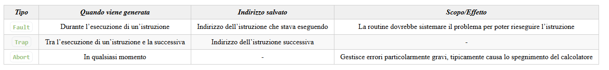

# Eccezioni

Sono un  tipo di interruzioni che devono essere eseguite immediatamente e non sono mascherate; queste passano attraverso dei fili diversi da quelli delle normali interruzioni.

Anche queste sono collegate a determinate routine che sono presenti nella tabella IDT alle prime 32 entrate. In particolare alcune eccezioni famose sono

- 0: Divisione per zero
- 1: Single-Step: viene avviato se il flag `TF` è settato. Il processore genererà quindi un’eccezione alla fine di ogni istruzione eseguita.
- 3: Eccezione di debug (istruzione `int3`)

## Eccezione di debug `int3`

Questa eccezione permette al debugger di avere il controllo sul flusso di programmi su cui vi è stato eseguito, compresi i segnali di continue.

## Gestione eccezioni

Possono essere chiamate in un qualsiasi momento, sono di 3 tipi:



Siamo anche in grado di scrivercele da soli:

```cpp
#include <libce.h>

extern "C" void a_divPerZero();
extern "C" void c_divPerZero(natq rip) {
    printf("Divisione per 0, all'indirizzo %lx!\n", rip);
}

int main() {
    int b = 0;
    gate_init(0, a_divPerZero);
    /*
    *  Inizializzo la riga 0 della IDT(DivisionPerZeroFault)
    *  con la mia funzione
    */

    int a = 3 / b;
}
```

```assembly
  .global divPerZero
divPerZero:
    NOP
    MOVq (%rsp), %rdi
    CALL c_divPerZero
    IRETq
```
