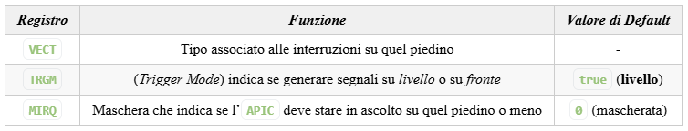

# Interruzioni

Per come è stato costruito, il processore lavora su un flusso di controllo deciso dal software.

Il programmatore magari vorrebbe utilizzare un modello diverso di programmazione, uno che permetta di associare dei programmi a degli eventi.\
Il numero di eventi possibili è finito e determinato, ed il programmatore vi può associare una sua routine.

Quello che vorremmo è che il processore, mentre sta eseguendo il programma `p`, stia in ascolto di eventi da gestire con routine in modo tale che, nel momento in cui venga generato, si possa mettere in pausa `p` per gestire l'evento; una volta gestito l'evento, il processore dovrebbe riprendere `p` nell'esatto punto in cui si è interrotto.

Uno dei primi a studiare questo aspetto è stato Dijsktra, con il seguente problema:

Ipotizziamo di avere una tabella contenente due indici:

- Nel primo si trova un numero $x$ crescente
- Nel secondo si trova il valore di una funzione $f(x)$ calcolata sul valore di $x$ attuale.

Vorremmo che venissero stampati le coppie valore $x,f(x)$

Supponiamo di aver collegato un dispositivo stampante che si occupa appunto di stampare questi elementi.\
Questa stampante possiede due registri:

- `TBR` (trasmit buffer register) che contiene il valore di $f(x)$
- `STS`(registro di stato) che si occupa di fare handshake, contiene un flag che indica quando la stampante è pronta per stampare un nuovo valore.

Un possibile flusso di istruzioni diventa quindi:

1. Calcolo di $f(x_1)$
2. lo inserisco nella stampante
3. attendo la fine della stampa (cioè aspetto `checkFlag()`)
4. calcolo di $f(x_2)$
5. ...

Qui però abbiamo del tempo morto mentre si attende il `checkFlag()`, sarebbe molto comodo poter usare il tempo morto per precalcolare le successive $f(x_i)$

Volendo potrei fare il controllo più volte all'interno del programma, ma come?

```cpp
checkFlag();
for(int i = 0; i < 1000000; ++i)
    a += i;
checkFlag();
```

Che però è troppo raro;

```cpp
for(int i = 0; i < 1000000; ++i){
    checkFlag()
    a += i;
}
```

Che però risulta troppo frequente; quello che faremo quindi è modificare l'hardware per permetterci di farlo.

Se ritorniamo al nostro esempio, quello che possiamo fare per supportare gli eventi di questa interfaccia è collegare fisicamente il bit della stampante alla CPU e aggiungere una $\mu$-istruzione che controlla il bit al termine di ogni istruzione.

Essendo solo un evento, il programmatore ha la possibilità di scrivere un programma che personalizzi la routine, utilizzando un indirizzo di memoria dedicato.


Quindi il comportamento è facile da immaginare:

> Nel caso in cui la $\mu$-istruzione verifichi `FLAG == 1` il processore salta alla routine e la esegue per poi resettare il bit in `STS`.

Nel caso della stampa però dobbiamo fare delle precisazioni:

- Se il $\mu$-programma resettasse `READY` e basta, si entrerebbe in loop. Questo accadrebbe perché `TBR` non verrebbe mai di fatto aggiornato tra una stampa e l’altra.
- Il processore vede continuamente il segnale `READY` come settato ricevendo di fatto infinite richieste, quando in realtà vogliamo solamente una richiesta singola.

Per rimediare a questi problemi è sufficente inserire un generatore di impulsi e un `FF-SR` che verrà resettato quando la richiesta sarà stata già presa in attenzione.

Per quanto riguarda la gestione delle interruzioni durante routine, nel processore intelx86 esiste un flag aggiuntivo in `RFLAG`, chiamato `IF` (Interrupt Flag). Se il bit è resettato, il processore non accetta nuove richieste finché non ha terminato quella attuale. Per poterlo manipolare esistono due istruzioni:

- `STI` (SeT Interrupt flag)
- `CLI` (CLear Interrupt flag).

Quando il processore accetta un’interruzione salva nella pila diverse informazioni, tra le quali:

- `RIP` per capire dove tornare al termine della routine
- `RFLAG` per poter poi ripristinare i flag come se la routine non fosse mai avvenuta.

Nelle routine ci sono alcune regole da seguire:

1. Ricordarsi di settare e resettare correttamente `IF` tramite le istruzioni `STI` e `CLI`
2. Utilizzare l’istruzione `IRETq` piuttosto che `RET`. `IRETq` infatti si ripristina lo stato del processore a prima che la routine iniziasse, in particolare ripristina `RFLAG` e gli altri registri prima di ripristinare `RIP`.

## Come funziona veramente

Noi abbiamo fatto l'esempio con solo una stampante per capire come funziona, nella realtà più oggetti possono chiedere un'interruzione per far partire un evento di routine.

In particolare nela nostra macchina QEMU le uniche cose che possono generare eventi sono la tastiera (presenza di un nuovo valore non letto in RBR), il timer(segnali generati dal contatore 0 quando si azzera per richieste temporizzate) e l'hardisk(presenza di un nuovo valore non letto nel buffer interno/scrittura dei nuovi valori completata).

Per affrontare tutte queste possibili richieste è necessario aggiungere un pezzo che me le raccolga tutte, __l'Apic__

Il controllore è collegato alle periferiche tramite tre fili, ognuna collegata ad un piedino noto dalle specifiche. Nel nostro calcolatore i dispositivi rilevanti sono connessi ai seguenti piedini:

- Tastiera $\iff$ 1
- Timer $\iff$ 2
- Hard Disk $\iff$ 14

Quando uno di questi segnali viene settato l’`APIC` invia alla CPU un segnale tramite un suo registro interno chiamato `INTR` (INTervall Request), inizializzando un handshake.


Per permettere di capire chi è la sorgente del segnale, il programmatore associa ad ogni piedino del controllore APIC un tipo, ovvero una codifica su 8bit.

Nel momento in cui la CPU accetta la richiesta, si prepara inviando il segnale di handshake tramite il filo `INTA`: INTervall Acknowledge.

Successivamente l’APIC carica il tipo sul bus così che la CPU lo possa leggere.

Vedremo successivamente che l’APIC conserva tre informazioni per ogni piedino:



Affinché tutto questo funzioni, la __CPU__ ha un suo registro interno chiamato `IDTR` (Interrupt Descriptor Table Register) che ha salvato l’indirizzo della IDT salvata in memoria. La IDT è una tabella che ha per ogni riga delle informazioni che vedremo meglio nel dettaglio nella sezione dedicata alla Protezione. Alcune di queste informazioni sono:

- Indirizzo della routine dove saltare
- Flag per capire se la CPU deve disabilitare IF o meno durante la routine.

La IDT deve essere allocata dal programmatore, e ogni sua riga viene identificata dal tipo che il programmatore ha precedentemente dato ai piedini dell’APIC.

Da software questo si fa con i seguenti comandi:

```cpp
#include<libce.h>

namespace kbd {

 const ioaddr iCMR = 0x64;
 const ioaddr iTBR = 0x60;

 void enable_intr() {
  outputb(0x60, iCMR);
  outputb(0x61, iTBR);
 }

 void disable_intr() {
  outputb(0x60, iCMR);
  outputb(0x60, iTBR);
 }

}
```

```cpp
const natb KBD_VECT = 0x40;             // Valore di Esempio

apic::set_VECT(1, KBD_VECT);		// Scelgo il valore 0x40 per il piedino 1 (associato alla tastiera)
gate_init(KBD_VECT, tastiera);		// Associo la funzione tastiera() al tipo 0x40
apic::set_MIRQ(1, false);		    // Azzera la maschera affinché non vengano accettate nuove interruzioni durante quelle in esecuzione
kbd::enable_intr();		        	// Permetto alla tastiera di generare segnali di interruzione
```

Il comando `gate_init()` ha un terzo parametro settato di default su false, che imposta `IF = 0` durante le routine, affinché non possano essere interrotte. Se volessimo invece che una routine possa essere interrotta, dobbiamo __impostarlo esplicitamente a true__.

Per capire se c’è una nuova richiesta o meno, si utilizza un metodo software chiamato __controllo su Livello__. Questo tipo di controllo fa in modo che l’APIC, dopo aver inviato una richiesta, guardi nuovamente i piedini solo dopo aver ricevuto il segnale di gestione completata dell'interruzione. 
Per inviare questo segnale il software utilizza il registro EOI (End Of Interrupt) del controllore APIC.

Per evitare comportamenti indesiderati da parte dell’APIC è importante che questo bit venga settato quando tutta la routine è terminata e non c’è altro da fare. Se così non fosse, il controllore potrebbe reinviare segnali di interruzioni su eventi già gestiti.

Per gestire le richieste di interruzione, l’APIC, oltre a `EOI`, possiede altri due registri a 256bit:

- `ISR` (In Service Register): conserva informazioni relative ai tipi accettati dalla CPU e non ancora terminati.
- `IRR` (Interrupt Request Register): conserva informazioni relative alle richieste dei tipi non ancora accettati.

Nel debugger della macchina QEMU esiste il comando `apic` che ci permette di visualizzare il contenuto di questi due registri.

Vediamo quindi nel dettaglio come vengono utilizzati questi registri nel prossimo capitolo.

## Gestione di più richieste

Se manteniamo il `IF = 1`, quando avvengono due richieste di interruzione dobbiamo porci la domanda se abbia senso interrompere la prima interruzione o attendere prima che qeusta venga completata.

La scelta ricade __esclusivamente sulla priorità che il programmatore dà alle varie interruzioni__, e può cambiare da caso a caso: attendere per la visualizzazione di un carattere a schermo può non provocare problemi, mentre se abbiamo una richiesta attraverso il timer, non gestirla può provocare perdita di richieste, e quindi ha più senso interrompere anche le eventuali interruzioni.

__Interrompere le interruzioni è ovviamente un’operazione lecita__, dopotutto le interruzioni funzionano a pila, e non vanno a toccarsi tra di loro se ben gestite.

Il programmatore ha quindi il compito di assegnare una precedenza alle varie richieste, e lo fa _tramite il tipo_.

Quando assegna un tipo il programmatore ha 8bit, dove i __4 più significativi__ indicano la classe di precedenza.

Se arriva una nuova richiesta che ha classe strettamente maggiore l’APIC invierà una nuova richiesta, negli altri casi attenderà EOI, per poi inviare la successiva richiesta con classe più alta in `IRR`. Nel caso in cui ci fossero più richieste con la stessa classe di priorità, andrà a discriminare sui 4bit meno significativi, inviando quella con il valore più alto.

In ogni caso l'ultima parola sull'eseguire in maniera effettiva o meno l'interruzione spetta alla CPU. Solamente quando la CPU invierà il segnale di `INTA` l’APIC sceglierà la richiesta di classe più elevata in IRR e la sposterà in ISR.

È inoltre possibile configurare l’APIC affinché legga le richieste sui fronti di salita o sui fronti di discesa.

Con la tastiera abbiamo visto le richieste su livello, vediamo ora come impostare quelle sul fronte di salita tramite il contatore:

```cpp
#include <libce.h>

namespace timer {

 static const ioaddr iCWR = 0x43;
 static const ioaddr iCTR0_LOW = 0x40;
 static const ioaddr iCTR0_HIG = 0x40;

 void start(natw N) {
  outputb(0b00110100, iCWR);        // contatore 0 in modo 2
  outputb(N, iCTR0_LOW);
  outputb(N >> 8, iCTR0_HIG);
 }
}
```

```cpp
volatile natq counter = 0;
extern "C" void c_timer() {
 counter++;
 apic::send_EOI();
}
```

```cpp
extern "C" void a_timer();
const natb TIM_VECT = 0x50;		    // tipo
void main() {
	apic::set_VECT(2, TIM_VECT);	// piedino 2 è il timer
	gate_init(TIM_VECT, a_timer);	// riempiamo la riga di IDT con la routine
	timer::start0(59660); 		    // periodo di 50ms (50/1000 * 1193192.66...)
	apic::set_TRGM(2, false);
    /*
    * Trigger Mode: genera segnale sul piedino 2 quando avviene
    *   false=riconoscimento su fronte,
    *   true=riconoscimento su livello
    */

	apic::set_MIRQ(2, false);		// Inizia a guardare il piedino 2

	for (volatile int i = 0; i < 100000000; i++)
		;							// Attendiamo a vuoto un po'

	printf("counter = %lu\n", counter);
	pause();
}
```

```assembly
#include <libce.h>
; .....
	.global a_timer
	.extern c_timer
a_timer:
	salva_registri
	call c_timer
	carica_registri
	iretq
```

IL timer genera un’onda quadra. Abbiamo inserito un periodo di `50ms` perciò il segnale sarà ad `1` per `25ms` e a `0` per `25ms`.

Se avessimo impostato `apic::setTRGM(2, true)`, avremmo avuto molte più richieste. Infatti, il segnale è settato per `25ms`, che è un tempo molto maggiore del tempo necessario a eseguire la routine, e ogni volta che terminerà la routine la farà ripartire con lo stesso segnale.

## Gestione corretta delle routine

Il compilatore non ha idea di come distiguere le funzioni routine dalle altre. Perciò il comportamento di default segue le classiche politiche di compilazione:

1. Terminare la traduzione del codice con una classica `RET` invece che di `IRETq`,
2. Ottimizzare il codice senza tenere conto del fatto che, per via delle interruzioni, alcune variabili/registri potrebbero subire modifiche in maniera non prevedibile

__Per ovviare a ciò quello che facciamo è inserire manualmente degli snippet in assembler per poter terminare la chiamata alla funzione con la IRETq:__

nel .cpp

```cpp
extern "C" void a_tastiera();

extern "C" void c_tastiera(){
    /* Implementazione */
    apic::setEOI();         //! IMPORTANTE !//
}
```

nel .s

```assembly
	.global a_tastiera
	.extern c_tastiera
a_tastiera:
    CALL c_tastiera
    IRETq
```

Un altro errore comune generato dalle interruzioni è quello di sovrascrivere i registri utilizzati dal flusso principale.

Questo succede per via di una convenzione, che stabilisce cha alcuni registri sono ad utilizzo libero, e non è quindi richiesto alle funzioni di ripristinarli al termine della loro esecuzione. Tra questi registri abbiamo ad esempio il registro `%rcx`. Nel caso in cui sia il nostro flusso principale che la routine utilizzino `%rcx` la probabilità che il programma abbia dei comportamenti inaspettati è molto elevata.

Per ovviare anche a questo la soluzione è quella di salvare il contenuto di tutti i registri nella pila. In assembly su 64bit non esistono equivalenti della `PUSHAD`/`POPAD`, ma possiamo utilizzare una macro messa a disposizione dalla libreria, trasformando il nostro codice così:

```assembly
#include <libce.h>
	.global a_tastiera
	.extern c_tastiera
a_tastiera:
	salva_registri
	call c_tastiera
	carica_registri
	iretq
```

Un altro tipo di problemi che compaiono spesso sono quelli generati quando le routine modificano variabili globali che nel flusso principale non dovrebbero variare. Il compilatore, quando ottimizza, eviterà infatti di effettuare controlli multipli su una variabile che sa non cambiare mai, ignorando che queste modifiche potrebbero avvenire per via della routine.

Per “forzare” il compilatore a controllare queste variabili, un metodo è quello di utilizzare la keyword `volatile`, che indica al compilatore che la variabile ha un comportamento inaspettato, e che quindi non può dare per scontato le sue variazioni.

```cpp
volatile bool fine = false;
```

Il problema di quando più flussi operano sulle stesse variabili è stato chiamato “Vaso di Pandora” da Dijsktra. La gestione di questi casi può diventare infatti estremamente complessa.
