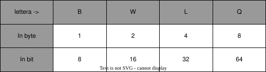
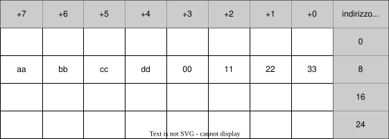
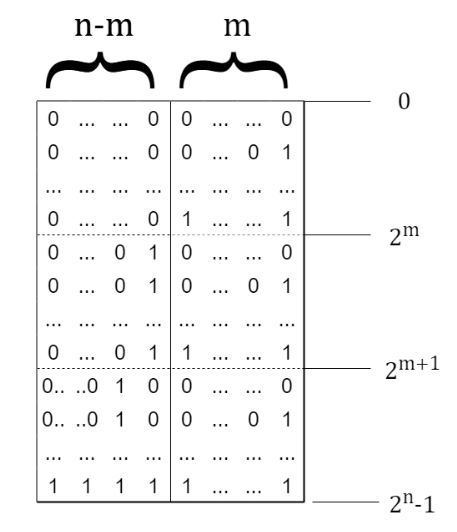
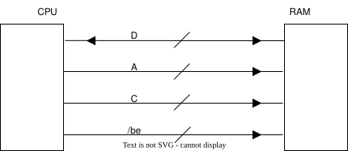

# La Memoria

è un dispositivo a cui possiamo fare accesso al byte a costo costante a qualsiasi indirizzo in un qualsiasi momento.

Per comodità indicheremo gli indirizzi in base 8 o in base 16, vediamo alcuni casi notevoli di notazione:

- 512=$(1000)_8$
- 4Ki=$(1000)_{16}=(10000)_8$
- 1Mi=$(10000)_16$
- 4Gi=$(100000000)_{16}$

Nelle memorie del processore che usiamo possimo fare accesso alla memoria in diverse dimensioni, in particolare possiamo accedervi con le seguenti dimensioni:

Questo assicura la retrocompatibilità con i processori più vecchi (e quindi più piccoli)

## Come si leggono gli indirizzi

Supponiamo di avere il seguente indirizzo:

 **_0xaabbccdd00112233_**

 Lo possiamo leggere in due modi:

 Partendo da _aa_ ed andare verso destra (**notazione big endian**, tipica dei protocolli web) oppure si può leggere partendo da _33_ ed andare verso sinistra (**notazione little  endian**, quella che useremo noi).

La memoria graficamente è strutturata in questo modo:

Dato che per noi la memoria è strutturata in questo modo è possibile dare delle definizioni utili per orientarci nello spazio di memoria.

Già sottolineo che le operazioni tra indirizzi vanno pensate in modulo $ 2^n $

## Offset

L'offset è la distanza (numero di bit in modulo $2^n$) che separa 2 bit scelti:

**fine-inizio** $\implies y-x$, se negativo, ovvero $y<x$, possiamo fare il roundup calcolando $|y-x|_{2^n}$

## Intervalli

Un'intervallo o range è una sequenza di indirizzi contigui, per evitare problemi imponiamo come regola di non poter usare intervalli dove è necessario fare il wrapup (dove x>y tranne il caso dove y=0). l'intervallo comprende l'indirizzo x ma esclude l'indirizzo y:

$[x,y):=\{n \ | \ x\le n\le y\}$ allo stesso tempo siamo in grado di ricavarci la lunghezza dell'intervallo $(l=x-y)$

## Oggetti

Definisco come oggetto **o** un intervallo (per semplicità) $o:=[x,x+l)$

### Allineamento a $2^n$

$o$ si dice allineato ad un numero $2^n$ se $|o|_{2^n}=0$, cioè se è possibile calcolare $o=k\cdot2^n$\
Ad esempio voglio controllare se un indirizzo è allineato a 4:

- `0xaa..4344`$\rightarrow$ allineato a 4
- `0xaa..4344`$\rightarrow$ non allineato a 4

### Allineamento ad oggetti

$o$ si dice allineato ad un altro oggetto $r$ con $sizeof(r)=2^k$ se $|o|_{sizeof(r)}=0$

### Allineamento naturale

$o$ si dice allineato naturalmente se $|o|_{sizeof(o)}=0$

## Regione e confine

I confini sono degli indirizzi particolari, una regione è identificata da 2 confini. Facciamo un esempio pratico:

|||
|--|--|
||La prima regione $[0,2^m)$ è identificata da indirizzi i cui n-m MSB sono pari a 0. La seconda regione $[2^m,2^{m+1})$ è identificata dagli n-m-1 MSB a 0 e l'(n-1)-ennesimo ad 1, mentre l'ultima regione identifica i restanti indirizzi|

Nella RAM possiamo identificare una regione con spazi di 8 byte; per ogni spazio sfrutteremo i bit [2:0] (detti byte Enabler BE) per rappresentare l'offset all'interno della riga da 8 byte.

## Come avviene la comunicazione tra CPU e Memoria

Le istruzioni del nostro processore possono avere al massimo un solo operando esplicito in memoria; nonostante ciò è possibile operare con due operandi in memoria tramite l'utilizzo di operandi che hanno accessi impliciti.

Ogni informazione che va in memoria ha 2 proprietà: l'indirizzo della prima locazione di memoria desiderata, e la dimensione che occupa (deducibile dal suffisso usato o dal registro usato).

Questi due elmenti sono connessi tramite un bus che è composto come segue:

|||
|--|--|
||- D rappresenta le linee di indirizzo, tendenzialmente sono 48 e non 64; - A indica il numero di riga che si vuole accedere; - C i fili di controllo; - /be sono i byte enabler.|

Ogni chip che compone la RAM ha la seguente forma ed i seguenti collegamenti possibili:

Questo ci indica anche quanto sia importante avere le cose allineate: se non lo fossero, per recuperare una sola informazione ci sarebbe da fare 2 accessi a 2 righe successive solo per parte delle info.

Date tutte queste informazioni vediamo come si incrociano:

dato un intervallo $[x,y)$ non è detto che stia in una sola regione, perciò è più facile capire quale è la prima regione toccata e la prima regione non toccata.

Dato b (la lunghezza di ogni sezione), le due regioni di nostro interessesi calcolano come:

`r1=x >> b` la prima regione toccata; `r2=(((y-1)>>b)+1) &b((1UL << b) - 1)` la prima regione non toccata.

L'offset del primo indirizzo nella regione è calcolabile come `off= x & ((1UL << b)- 1)`
