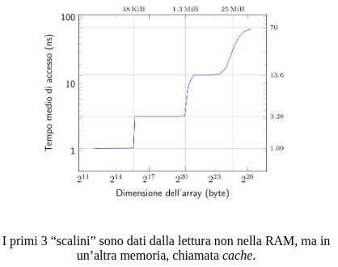

# Memoria cache

Con la RAM abbiamo un problema: è molto più lenta di un processore, ed il processore quindi viene messo in attesa.

è possibile vedere quanto tempo ci mette il processore ad accedere alla RAM in base alla dimensione della lettura:

In nostro aiuto arriva la cache che è molto più veloce della RAM dinamica,(per informazioni  di dimensioni "piccole" arriva all'odine della velocità del clock).

Una RAM più veloce è la RAM statica( conserva l’informazione tramite Flip-Flop, e sono realizzabile con 6/7 transistor. Le RAM Dinamiche invece utilizzano microcondensatori che necessitano che l’informazione venga periodicamente “rinfrescata”), il problema è il costo elevato per la piccola quantità della RAM statica, per cui non si usa la statica.

Esiste tuttavia un modo per poter utilizzare RAM grandi, economiche e veloci. Infatti, nonostante l’accesso del programmatore alla memoria sia per definizione casuale, ovvero non predeterminato, in realtà nella maggior parte dei casi non lo è realmente.

Il codice infatti si distribuisce in locazioni di memoria sequenziali, e, statisticamente, raramente effettua salti casuali tra istruzioni. Su questa assunzione di base si fondano i due Principi di Località:

>Principio di località Temporale: visto un dato è probabile che molto presto si voglia utilizzare di nuovo.
>
>Principio di località Spaziale: visto un indirizzo è probabile che a breve ci si ritorni.

La cache si basa proprio su questi principi: quando accederemo alla RAM, la cache sarà in ascolto di letture e scritture, salvandosi in locale tutti quei dati che, per i principi sopra detti, ci serviranno.

La sua posizione nello schema a blocchi è:

La sua esecuzione è gestita da un controllore che lavora in modo trasparente (il processore e il programmatore ignorano la sua esistenza -non la vedono-)

Ciò che succede nel normale flusso degli eventi è che: quando la CPU richiede un dato, il controllore controlla se lo ha già salvato, in caso positivo ritorna subito il dato, altrimenti inoltra la richiesta di lettura alla ram e quando arriva la risposta, prima di rimandarla alla CPU se la salva localmente (nel caso sostituendo i dati che l'architettura determina).

## Indirizzamento diretto

Vediamo quindi nel dettaglio come funziona questo controllo della presenza del dato.

Quando il processore richiede una locazione di memoria, si effettua un controllo per verificare che si trovi o meno nella cache, questo controllo termina con la trasmissione di un segnale che può essere:
- di `hit` indica che la memoria si trova già nella cache, perciò è sufficente leggere quella. In caso di scrittura con hit abbiamo due possibili politiche:
    - `Write Through`: scrive il nuovo valore sia in cache che in RAM;
    - `Write Back`: scrive il nuovo valore solo nella cache.
- di `miss` indica invece che la memoria non è nella cache, perciò va recuperato dalla RAM per poter essere letto.\
Anche in caso di miss la scrittura ha due possibili politiche:

    - `Write Allocate`: copia l’elemento dalla RAM nella cache prima della modifica, e poi lo ritrasmette aggiornato;
    - `Write No-Allocate`: effettua l’aggiornamento solo in RAM, senza salvare nulla in cache

Il motivo per il quale, data una riga, recuperiamo in cache tutta la sezione dov’è contenuta è perché, per il principio di località, è probabile che il processore richieda in un secondo momento locazioni vicine (località spaziale). Inoltre, se il tempo di lettura di una riga fosse $t$, quella di lettura di un blocco è un tempo $<<8t$.

Questo tipo di cache, detta ad indirizzamento diretto, può generare conflitti tra sezioni. In particolare, le sezioni che possono fare conflitto in una stessa locazione sono $\frac{dim(RAM)}{dim(cache)}$, ovvero quelle allineate naturalmente a l, con l che indica il numero di cache line disponibili.

Per quanto riguarda la write-back, la scrittura verrà comunque eseguita in RAM prima o poi, nel peggiore dei casi quando quella cache line viene sostituita. Il guadagno del non fare direttamente il write-through si vede quando effettuiamo un numero molto elevato di scritture nella stessa cache-line.

Per migliorare il tempo si aggiunge un’ulteriore bit alle etichette chiamato D (Dirty) che identifica se in una determinata cache-line sono avvenute o meno scritture.

Questo tipo di cache è particolarmente poco efficente quando cerchiamo di accedere a due cacheline in memoria allineate naturalmente alla dimensione della cache. In questo caso ogni accesso causa una miss, proprio perché i due indirizzi collidono. Un modo per risolvere il problema è attraverso le cache associative ad insiemi (che costa di più).

## Associative ad Insiemi