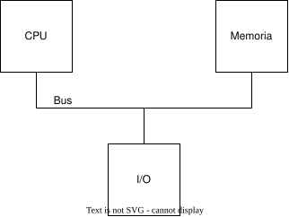
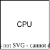
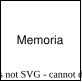
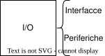
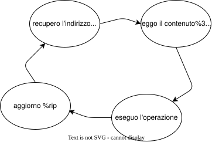

# Memoria e Periferiche

## Architettura per come l'abbiamo vista a reti

Di questo sistema sappiamo di cosa si occupa ogni singolo pezzo:

| Componente | Descrizione |
|---|---|
|  | Conosce il contenuto dei propri registri, ma non in quale contesto vengono usati. |
|  | Conosce i dati salvati nei propri indirizzi sottoforma di 0 e 1, ma non ne sa il significato |
|  | Conosce i segnali trasmessi uno alla volta in broadcast, tramite indirizzi nello spazio di memoria, ma non chi sta comunicando |
|  | Le periferiche tramite interfacce, viste come letture/scritture di registri con effetti collaterali, ma non conosce il significato di tali operazioni |

### Come si svogono le varie istruzioni nel calcolatore

Sempre a reti, siamo arrivati a capire come il calcolatore svolge le istruzioni:

Il controllo è comunque unico e può essere scambito tra i vari stati della CPU, scanditi dal programma in esecuzione.

All'avvio del calcolatore il contenuto della RAM è casuale, per questo motivo al reset viene caricato il programma di bootstrap che è salvato in ROM. (nella ROM è contenuto anche il BIOS)

## La fa l'hardware o il software?

è molto importante essere in grado di distinguere se una cosa viene svolta in hardware o in software, per capirlo basta porsi una sola domanda:

>Data una cosa x, so scrivere un programma che fa x?
>
>Il flusso è assegnato a quel processo? Come ci passo?

So rispondere?

Si: allora è software; || No: allora è hardware.
