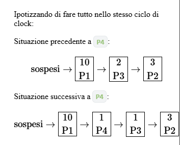

# Delay

Una cosa comoda da poter usare per chi programma è la possibilità di poter mettere in pausa o comunque poter tener traccia del tempo che passa durante l’esecuzione di un programma.

Quando un processo sta “dormendo”/ "in pausa" è a tutti gli effetti bloccato, ovvero in attesa di un evento che lo sblocchi. In questo caso l’evento è proprio il passaggio del tempo richiesto.

Per realizzare questa funzionalità, il metodo più semplice è quello di impostare __un timer__ affinché venga inviata una richiesta di interruzione con periodo fisso. Nel nostro sistema lo facciamo utilizzando il `timer 0` del PC AT, e programmandolo in modo che invii una richiesta ogni `50ms`.

La primitiva che abbiamo per usare questo meccanismo è la _delay_ `void delay(natl n)` tramite la quale un processo può chiedere di essere __sospeso per n cicli del timer__.

La primitiva inserisce _il processo_ in una __coda di processi sospesi__, salvando il valore di __n__. Chiamiamo `driver` (del timer) la routine che _va in esecuzione ogni volta che il timer invia una richiesta di interruzione_.

Il `driver` dovrà quindi occuparsi di:

1. Decrementare __n__ opportunamente
2. _Risvegliare_ i processi in attesa quando il loro `n == 0`, inserendoli in _coda pronti_.

Per capire come vengono gestite le strutture dati che si occupano di questo processo nel nostro sistema, supponiamo di avere tanti processi sospesi `Pi`, ognuno con `ni` cicli di attesa $(0\le i \le k)$.

Se `k` fosse __molto grande__, andare a modificare tutti i singoli `ni` risulterebbe in un operazione molto costosa, poiché richiederebbe che il driver debba decrementare __tutti i k contatori ad ogni interruzione__ del timer.

Operativamente quello che facciamo è quindi diverso:

- Manteniamo i processi in attesa _in una lista ordinata_ per cicli di attesa crescenti $n_1\le...\le n_k$ 
- Per ogni processo __non salviamo il numero di cicli totali__ che deve attendere, ma __quanti cicli in più rispetto al precedente.__
  
In altre parole, l’elemento in cima alla lista ($r_1$)memorizza ($n_1$), gli elementi $r_i$ con  ($1<i\le k$) memorizzeranno: $n_i-n_{i-1}$.

Così il driver deve decrementare __solo l’elemento in testa alla lista__. Quando questo elemento avrà il contatore a __0__, allora sposteremo i primi __k__ elementi con _contatore nullo_ nella lista `pronti`, reinserendovi anche il processo in `esecuzione`, per poi chiamare lo `schedulatore()`.

Facciamo un esempio:

```cpp
// P1
delay(10);		// P1 inserito come primo con t = 10
// P2
delay(15);		// P2 inserito come secondo con t = 15 - 10 = 5
// P3
delay(12);		// P3 inserito come secondo con t = 12 - 10 = 2
				// P2 aggiornato come terzo con t = 5-2 = 3
// P4
delay(11);		// P4 inserito come secondo con t = 11 - 10 = 1
				// P3 aggiornato come terzo con t = 2 - 1 = 1
				// P2 rimane invariato
```



## Come è implementata nel nucleo

La lista dei processi è così definita all’interno del file `sistema.cpp`:

```cpp
struct richiesta {
	/// tempo di attesa aggiuntivo rispetto alla richiesta precedente
	natl d_attesa;
	/// puntatore alla richiesta successiva
	richiesta* p_rich;
	/// descrittore del processo che ha effettuato la richiesta
	des_proc* pp;
};
richiesta* sospesi;
```

Ogni elemento della lista, oltre al puntatore `p_rich` necessario per realizzare la lista, contiene:

- `pp `: _puntatore al descrittore_ del processo sospeso
- `d_attesa`: tempo di attesa aggiuntivo _rispetto alla richiesta precedente_.

La __variabile globale__ `sospesi` punta alla testa della lista.

Vediamo l’implementazione di `inserimento_lista_attesa`:

```cpp
void inserimento_lista_attesa(richiesta* p) {
    richiesta *r, *precedente;

    r = sospesi;
    precedente = nullptr;

    // Cerco tra quali elementi dovrò inserire p
    while (r != nullptr && p->d_attesa > r->d_attesa) {
        // Ogni elemento che passo, rimuovo l'attesa da p
        p->d_attesa -= r->d_attesa;
        precedente = r;
        r = r->p_rich;
    }

    p->p_rich = r;
    if (precedente != nullptr)
        precedente->p_rich = p;
    else
        sospesi = p;

    // Aggiorno l'attesa del successivo in relazione a quello appena inserito
    if (r != nullptr)
        r->d_attesa -= p->d_attesa;
}
```

Alla lista accedono __due__ _routine di sistema_:

- `delay()`:è una _normale primitiva di sistema_ con un gate nella `IDT` e una parte scritta in `assembly`:

  - `sistema.s`
  
  ```assembly
    ; ...
    carica_gate TIPO_D  a_delay LIV_UTENTE
    ; ...
    .extern c_delay
    a_delay:
	    .cfi_startproc
	    .cfi_def_cfa_offset 40
	    .cfi_offset rip, -40
	    .cfi_offset rsp, -16
	    call salva_stato
	    call c_delay
	    call carica_stato
	    iretq
	    .cfi_endproc
    ```

  - `sistema.cpp`

    ``` cpp
    extern "C" void c_delay(natl n) {
	    // caso particolare:
        // se n è 0 non facciamo niente
	    if (!n)
		    return;

	    richiesta* p = new richiesta;
	    p->d_attesa = n;
	    p->pp = esecuzione;

	    inserimento_lista_attesa(p);
	    schedulatore();
    }
    ```

- `driver` _del timer_: segue sostanzialmente lo stesso schema di una primitiva, ma va in esecuzione per effetto di una __richiesta di interruzione__ e non per una istruzione `int`.

  - `sistema.s`
    ```assembly
    .extern c_driver_td
    driver_td:
	    .cfi_startproc
	    .cfi_def_cfa_offset 40
	    .cfi_offset rip, -40
	    .cfi_offset rsp, -16
	    call salva_stato
	    call c_driver_td
        ; Aggiungiamo il segnale all'APIC
	    call apic_send_EOI
	    call carica_stato
	    iretq
	    .cfi_endproc
    ```

  - `sistema.cpp`
  ```cpp
    extern "C" void c_driver_td(void) {
        inspronti();

	    if (sospesi != nullptr) {
            sospesi->d_attesa--;
	    }

	    while (sospesi != nullptr &&    sospesi->d_attesa == 0) {
            inserimento_lista(pronti, sospesi->pp);
		    richiesta* p = sospesi;
		    sospesi = sospesi->p_rich;
		    delete p;
	    }

	    schedulatore();
    }
    ```

Un’altra sostanziale differenza rispetto alle normali primitive, è che __nessuno esegue attivamente il driver__. Infatti _il processo che lo esegue_ non lo ha fatto volontariamente, ma _è stato interrotto dall’evento_. È persino probabile che il processo non sia nemmeno interessato a ciò che il driver deve fare.

# New

L’operatore `new` effettua una ricerca in memoria `heap` di uno _spazio sufficente_ a __caricare__ la struttura/oggetto desiderato.

L’operatore `new` che utilizziamo nel nostro ambiente utilizza una funzione di libce che gestisce una zona della memoria di sistema usata come `heap`.

L’`heap` consiste in __una sezione di MB della memoria__ dedicati. Nel programma di `bootstrap`, viene _inizializzato e utilizzata dai vari caricamenti dei processori_ (8bit, 16bit e successivamente 32bit). Quando tutti sono stati caricati correttamente, __la memoria viene liberata, e rimane disponibile per altri processi__.

Mentre per la modalità sistema gli accessi all’`heap` sono _atomici_, in quanto le interruzioni sono disabilitate, per quanto riguarda invece la modalità `utente`, poiché le interruzioni sono qui attive, l’accesso ad esso __rientra nel problema della mutua esclusione__, risolvibile con un semaforo.

Nel nostro nucleo gli operatori di `new` e `delete` si limitano a richiamare in modo appropriato gli overload di `operator new` e `operator delete` forniti dalla libce. Questi si limitano ad usare in maniera opportuna `alloc()`, `alloc_aligned()` e `dealloc()`.

```cpp
/* libce.h */
void *operator new(size_t s);
void *operator new(size_t, std::align_val_t a);
void operator delete(void *p);
```

```cpp
/* bare/new.cpp */
void* operator new(size_t s) {
	return alloc(s);
}
```

```cpp
/* bare/new_alligned.cpp */
void* operator new(size_t s, std::align_val_t a) {
	return alloc_aligned(s, a);
}
```

```cpp
/* bare/delete.cpp */
void operator delete(void *p) {
	dealloc(p);
}
```