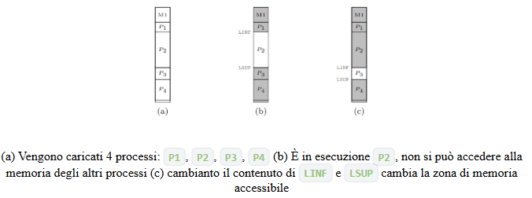
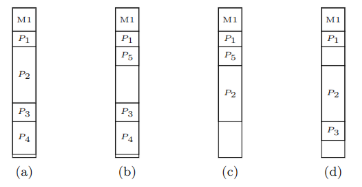
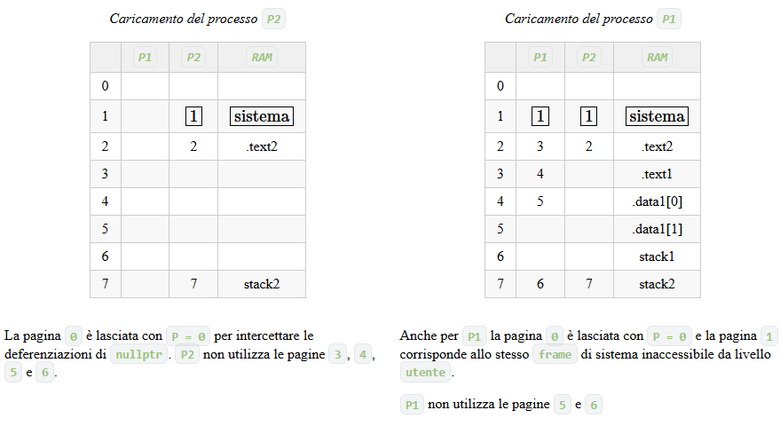
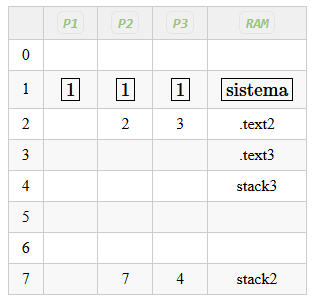
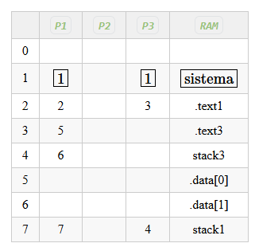
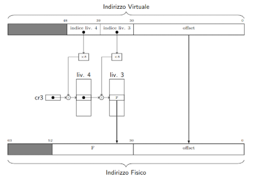
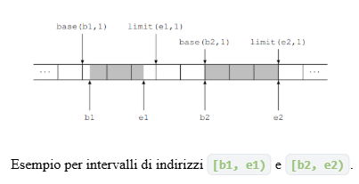

# La comodità ha un un prezzo troppo alto

Fino ad ora la memoria per noi era divisa in M1 (memoria esclusiva del sistema) e M2 (memoria esclusiva dell'utente), con la regola che in M2 ci sta solo la memoria del processo attuale, mentre gli altri stanno nell'HD (questa cosa però è inefficente perchè ogni volta che c'è uno swap dell'intera memoria)

Quello che vogliamo fare ora è eliminare, o almeno ridurre, le copie da e verso lo swap, tenendo a mente che ci piacerebbe comunque preservare i vantaggi che ha trasferire tutta la M2, ovvero:

- __Isolamento tra i processi__: ciascun processo può accedere solo alla propria memoria privata
- __Semplicità nel collegamento dei programmi__: il collegatore può assumere che ogni programma abbia a disposizione l’intera M2
- __Semplicità nel (s)caricamento dei processi__: la memoria privata di ogni processo viene __ricaricata esattemente nella stessa posizione__ ogni volta che il processo torna in esecuzione
- __Possibilità di condivisione della memoria__: se più processi hanno bisogno di condividere memoria tra loro, il sistema può concederlo evitando di sostituire le parti di memoria condivise ogni volta che cambia processo.
  
Per capirsi ogni processo “pensa” di avere la `CPU` e la `M2` tutta per sé, quando in realtà ha una `CPU` __virtuale__ e una `M2 `__virtuale__. Le vere componenti __incarnano__ ad ogni istante le controparti virtuali _del processo attualmente in esecuzione_.

La memoria sarà quindi divisa in diverse _sezioni_, ognuna  assegnata ad un processo. All’interno di ogni `M2 virtuale` troviamo due sezioni:

- Codice: sezione `.text` dell’`assembler`
- Memoria: divisa a sua volta in:
  - sezione `.data` dell’assembler
  - `stack` e `heap` complementari

I riferimenti alla memoria tramite “puntatori complementari”, sta a significare che i due puntatori si trovano ai capi opposti __della stessa regione di memoria.__ Lo `stack` “sale” in memoria mentre l’`heap` "scende", prendendo spazio finché non collidono, generando un’eccezione di riempimento della memoria.

Per implementare questa divisione è necessario _il supporto dell’hardware_.

Esistono diversi metodi per implementarlo, noi ne vedremo qualcuno.

## Registri limite inferiore e superiore

Questo metodo __suppone di sapere__ di quanta memoria ha bisogno ogni processo per contenere:

- La sezione `.text` con il codice del programma da eseguire
- La sezione `.data` di variabili globali
- La sezione dedicata a `stack` e `heap`

Mentre delle prime due sezioni il collegatore conosce sempre la dimensione, per quanto riguarda la terza, essa può essere soggetta a _espansione dinamica_ durante l’esecuzione.

È allora necessario stabilirne una __dimensione massima__. Questa scelta può essere effettuata _dal programmatore_, che informa il sistema di quanto grande debbano essere le porzione dedicate allo stack e allo heap. In alternativa è anche possibile che il compilatore/collegatore/sistema assumano _un valore di default_.

Una volta che l’informazione è nota, il sistema può sfruttarla per copiare da e verso lo swap solamente la memoria usata dai processi entranti e uscenti.

Per vietare all’utente l’accesso alle porzioni di `M2` di _processi diversi_, si inseriscono nella CPU __due registri__, `LINF` e `LSUP`, che hanno come compito quello di contenere _gli indirizzi_ __dell’inizio__ e __della fine__ della _porzione di memoria virtuale_ del _processo in esecuzione_. Entrambi i registri sono __scrivibili solo da livello sistema__.

Quando la CPU lavora in modalità utente, _deve controllare che gli accessi siano in indirizzi compresi nell’intervallo_ __[__ `LINF`, `LSUP`__]__.\
(In caso di accessi `out-of-bound` $\rightarrow$$ un’eccezione di protezione `13`.)

Poiché la maggior parte dei processi __non__ avrà bisogno di tutta la memoria `M2`, possiamo pensare di caricare più di uno stato alla volta, tenendo anche lo stato dei __processi presenti ma non in esecuzione__, così da evitare di ricaricarli quando verranno schedulati.

In pratica rendiamo la memoria `M2` come _una cache dello swap_, con gli stessi problemi da risolvere, ovvero quale processo rimuovere quando la memoria si satura. Non ci addentriamo in questi problemi adesso, che vedremo più avanti in un altro corso.\
Ci limitiamo a studiare i meccanismi che permettono di realizzare questa cache.



Per permettere questa configurazione `LINF` non contiene più il primo indirizzo di `M2`, ma bensì __quello della prima locazione appartenente al processo in esecuzione__. Quindi questi registri devono avere una posizione nel vettore `contesto` __dei descrittori di processo__, ovvero `I_LINF` e `I_LSUP`:

- _Ogni volta_ che un __processo viene caricato__ dallo swap il sistema, riferendosi alla parte di M2 da lui occupata, _deve inizializzarne i campi_:
  - `contesto[I_LINF]` con __l’indirizzo iniziale__
  - `contesto[I_LSUP]` con __l’indirizzo finale__
- _Ogni volta_ che si cambia processo, il sistema __aggiorna anche il contenuto__ di `LINF` e `LSUP` con _i valori presi dal descrittore del processo entrante_.
  
(Permettendo così alla CPU di controllare che ogni processo non effettui accessi out-of-bound rispetto alla memoria assegnata)

### Problemi con questo approccio 

__Questa soluzione presenta però dei difetti e dei problemi.__

1.  dove salvare la sezione `.text` di ogni processo?
   
A differenza della memoria unica, (dove la sezione `.text` aveva un indirizzo costante salvata (`LINF`)) il _collegatore_, si troverà __indirizzi di partenza variabili__ a seconda dello stato del sistema.

- Ci sono __due modi per risolvere__ questo problema:

    - Compilare __tutti__ i programmi in modo che __siano indipendenti dalla posizione__. Questo è possibile e funziona entro certi limiti, poiché gli _offset_ possibili sono esprimibili su massimo `32bit` (`2GB`)
    - __Creare un caricatore rilocante__, che riloca il programma al posto del collegatore e, nel momento della carica, lo modifica in modo da adattarlo all’indirizzo di caricamento.
  
2. i processi potrebbero utilizzare indirizzi __assoluti__ per salvare oggetti in memoria.

Ciò che prima non era un problema adesso lo diventa (ed anche bello grosso).\
Ipotizziamo di avere un processo `P1` che salva __un indirizzo assoluto nella sua partizione__. Questo processo viene poi rimosso e rilocato in un’altra, _diversa_ dalla prima. A questo punto l’indirizzo assoluto che era utilizzato non sarà più disponibile, in quanto si riferisce ad una partizione adesso `out-of-bound`.

Esiste quindi il __vincolo forte__:

> Se un processo è locato in una __determinata partizione__ della memoria, nel caso di scarica e carica, __dovrà sempre essere rilocato nello stessa posizione__.

3.  manca la memoria condivisa, __possibile__ con questo hardware, __solamente tra processi in partizioni adiacenti__. Per risolvere, va cambiata __l’interpetazione degli indirizzi da parte della CPU__:

> Da adesso in poi, la CPU interpreta ogni indirizzo `x` come `LINF + x`. In questo modo ogni indirizzo __“assoluto”__ di un processo, adesso indica semplicemente __l’offset da__ `LINF` di quel processo.

Questa implementazione fa in modo che ogni processo si comporti come se avesse una sua memoria dedicata, anche se in realtà non è altro che una memoria virtuale con indirizzi virtuali `x`, che sono tradotti dalla funzione `LINF + x` che li traduce in indirizzi fisici.

4. Permane comunque il problema della __frammentazione esterna__.

Prendiamo il seguente esempio:


Rimosso `P2` e inserito `P5`.
Rimosso `P3` e `P4` per inserire `P5`.
Terminato, e quindi rimosso `P5` e inserito `P3`.
Adesso non esiste più spazio per `P4`.

Per ovviare a questo problema i sistemi moderni utilizzano __una funzione di traduzione molto più complessa__, quella che chiamiamo _Paginazione_

# La Paginazione

Facciamo qualche cambiamento:
prendiamo la `RAM` e dividiamola in _frame_, ogni frame ha __dimensione fissa__ di `4KiB`; allo stesso modo, dato un processo, prendiamo il suo spazio di memoria e dividiamolo in __pagine__ di __dimensione fissa__ di `4KiB`.

Così da adesso ___ogni pagina può essere inserita in ogni frame___.

Così non c'è più frammentazione esterna, _poiché i programmi non necessitano di essere contigui_. Di conseguenza __non serviranno più__ i registri `LINF` e `LSUP`, che perdono completamente di senso.

Anche questa scelta _impone dei limiti_, uno dei quali è che __non posso dare ad un singolo processo uno spazio di memoria minore di `4KiB`__.

## Come so chi è dove?

come tenere traccia dei frame che corrispondano alle pagine?

Adottiamo come prima soluzione l’introduzione _un’array_, che chiamiameremo __Tabella di corrispondenza__ (da ora tabella), alla quale salviamo in ogni _posizione_, il numero del frame di riferimento. La _posizione_ `x` si riferirà alla `x-esima pagina` del processo.

Di conseguenza ogni indirizzo porta con se un significato ulteriore; ogni indirizzo può essere visto come l'unione di due parti `{a[p], o}` dove:

- `a[p]`: indica il numero di pagina, che viene convertito tramite la tabella nell’indirizzo del frame (f).
-`o`: è l’offset rispetto all’inizio della pagina.

In questo modo, quando accediamo all’indirizzo virtuale x di un processo, andiamo nell’indirizzo reale `f + o`.

Questa soluzione __mantiene l’isolamento__, poiché ogni processo avrà una sua tabella, e potrà accedere _ai soli ed unici frame contenuti in essa_. Quando questo non accade verrà sollevata l’eccezione di `page fault` (o segmentation fault nei sistemi Unix). Inoltre, questa soluzione non richiede di salvare la tabella nel contesto, poiché _la ricreeremo ogni volta_ che il processo verrà caricato.

Siamo inoltre __in grado di implementare una memoria condivisa__. Per permettere a due o più processi di condividere dei frame, _basta inserirli nelle loro tabelle_.

Questa soluzione ci permette quindi di decidere:

- Quali processi condividono della memoria
- Quali frame mantenere privati ad un processo e quali rendere condivisibili

## Come si fanno le tabelle?

Per implementare le tabelle, possiamo immaginare un nuovo dispositivo, chiamanto __Super MMU (Memory Management Unit)__. Questa super componente, _che nella realtà non esiste nella forma con la quale la descriveremo_, si trova __tra CPU e cache__. Il posizionamento è tale da permetterci di progettare la cache come se la MMU non esistesse.

__La super MMU__ si occupa quindi __della traduzione__: indirizzi virtuali $\rightarrow$ indirizzi fisici.

Vediamo quindi come modificare il `kernel` per implementare questo nuovo tipo di memoria nel caricamento dei processi.

Affinché tutto funzioni correttamente, diamo per scontato il fatto che la `Super MMU` sia __sempre attiva,__ anche mentre è in esecuzione il kernel.

Possiamo quindi inserire nella super MMU un nuovo array dedicato proprio a quest’ultimo. L’array __conserverà quindi per ogni frame il processo che lo sta occupando__. Sottolineiamo che questa soluzione non è quella utilizzata dai processori Intelx86.

Data questa struttura, capiamo quindi cosa succede durante le eccezioni quando vengono sollevate. Il kernel deve innanzitutto accedere alla riga corrispondente della IDT, ma per accedervi deve passare per la MMU poiché non ne conosce l’indirizzo fisico. È quindi necessario che la MMU abbia già fatto il cambio di tabella prima che l’eccezione venga sollevata. Per ovviare a possibili concorrenze che portano solamente ad errori, quello che facciamo è _“giocare di anticipo”_:

> Salveremo in ogni tabella di corrispondenza i frame relativi a M1.

Nei processori AMD si sfrutta la naturale divisione in due della memoria e si affida la parte superiore al `sistema` e quello inferiore all’`utente`. di fatto lo spazio di indirizzamento virtuale nelle due parti (`sistema` e `utente`).

Questa soluzione lascia però __in chiaro__ al programma __gli indirizzi della memoria di sistema__, cosa che noi _non vogliamo_.

Andiamo quindi a codificare in maniera più “complessa” le righe della __tabella di corrispondenza__:

- `P`: flag di presenza, indica se la traduzione nell’indirizzo esiste o meno, generando un’eccezione di page fault (in Unix segmentation fault). È __sempre 0 nella prima pagina__ (per il caso nullptr), e _nei kernel reali è azzerato per diverse prime pagine_ (per gestire opportunamente il caso di strutture più grandi di 4KiB).
- `R/W`: se __settato__ indica che sono ammesse _scritture_ nella pagina
- `U/S`: se __settato__ indica che sono _ammessi accessi_ alla pagina da livello `utente`. È questo bit che ci permette di vietare all’utente l’accesso alla memoria `M1`.
- `PCD`: Page Cache Disable, se __settato ordina alla cache di non intercettare l’operazione__ e lasciarla passare _inalterata_ sul bus, similmente a come si comporta per l’I/O
- `PWT`: Page Write Through, se __settato ordina alla cache di usare la politica di _write-through___ per questo accesso _(solo se in scrittura)_. __È annullato da PCD se quest’ultimo è settato__
- `A`, `D`: sono due flag legati _all’implementazione dell’area di swap_, che vedremo solo da un punto di vista teorico senza implementarla nel nostro calcolatore. La __MMU__ _setta_ `A` di un’entrata durante _l’accesso all’indirizzo interno della corrispondente pagina_. Se l’accesso era __in scrittura__ viene settato __anche__ `D`.
  -  `A` può essere usato quindi per capire _quali pagine sono le più utilizzate_. È di ausilio alla paginazione su domanda, nella quale vengono caricati in memoria solamente le pagine a cui il processo effettivamente accade, sfruttando il bit P e intercettando il page fault.
  - `D` può essere usato per __capire quali pagine hanno subito modifiche__ e necessitano di essere salvate ex-novo, e quali invece non sono state modificate e non necessitano il nuovo salvataggio.

### Esempio
Supponiamo di avere il seguente programma, nel quale abbiamo un array di `char` di dimensione `8KiB` che chiamiamo buf, e del quale vogliamo saperne la somma.

```cpp
char buf[0x2000] = { 2, 6, -1, 200, ..., 15, 3, -32, 1};
int main() {
    int sum = 0;
    for (int i = 0; i < 0x2000; i++)
        sum += buf[i];
    return sum;
}
```

Dobbiamo tradurre questo programma in una sequenza di byte da dare al processore.

Per poterlo fare dobbiamo sapere:

- Che CPU utilizziamo (Intelx64)
- Come è gestita la memoria
  
Per questo esempio supponiamo che lo __spazio di memoria virtuale sia di soltanto 32KiB__. Ciò implica che gli _indirizzi possibili stanno tra `0000` e `7fff_`. Se abbiamo che ogni pagina è 4KiB, implica che avremo a disposizione __8 pagine, 2__ delle quali (`0` e `1`) sono però __riservate al sistema.__

Dobbiamo quindi decidere come contenere il codice:

- `2`: `[2000, 2fff]` conterrà il codice
- `3-4`: `[3000, 4fff]` conterrà la variabile buf
- `7`: la usiamo come __prima pagina della pila.__

Una possibile traduzione è quindi la seguente. In memoria tuttavia andrà la traduzione in linguaggio macchina, che è presente sulla destra

```assembly

    |   .text
    |   .global main
    | main:
2000|     PUSHq %rbp                |55
2001|     MOVq %rsp, %rbp           |48 89 e5
2004|     SUBq $8, %rsp             |48 83 ec 08
2008|     MOVl $0, -8(%rbp)         |c7 45 f8 00 00 00 00
200f|     MOVl $0, -4(%rbp)         |c7 45 fc 00 00 00 00
    | for:                          |
2016|     CMPq $0x2000, -4(%rbp)    |48 81 7d fc 00 20 00 00
201e|     JGE fine                  |7d 14
2024|     MOVSlq -4(%rbp), %rcx     |48 63 4d fc
2028|     MOVSbl buf(%rcx), %eax    |0f be 81 00 30 00 00
202f|     ADDl %eax, -8(%rbp)       |01 45 f8
2032|     ADDl $1, -4(%rbp)         |83 45 fc 01
2036|     JMP for                   |eb e2
    | fine:                         |
203b|     MOVl -8(%rbp), %eax       |8b 45 f8
203e|     POPq %rbp                 |5d
203f|     ret                       |c3
    |                               |
    | .data                         |
3000| buf:    .BYTE 2, 6, -1, 200   |02 06 ff c8
    |         ...                   |...
4ffc|         .BYTE 15, 3, -32, 1   |0f 03 e0 01
```

Dopo aver caricato il programma in memoria, _inizializziamo i registri_:

- `%rip`: `0x2000`
- `%rsp`: `0x0000`
- `%rbp`: `0x0000`
- `%rcx`: `0x0000`
  
All’avvio del sistema la __CPU__ tenterà di prelevare l’istruzione contenuta in `%rip`, ovvero `0x2000`, per poi _analizzarla_ per scoprire che l’istruzione è l’equivalente di `PUSHq %rbp`.

La __CPU__ inizia quindi ad _eseguire l’istruzione_, decrementando per prima cosa `%rsp` di __8__, assumendo il valore `7ff8`. Una volta _terminata l’esecuzione_, `%rip` viene incrementato di __1__.

Il programma prosegue, arrivando alla riga 2028, _nella quale si accede alla memoria_ `.data` del programma. Da notare che è _presente l’indirizzo di buf come immediato esadecimale nel sorgente macchina_.

Verrà quindi sommato al contenuto di `%rcx (0)` e il risultato, interpretato come byte verrà sottoposto a lettura, salvandolo nel registro `%eax` (propriamente esteso).

Questo è quello che il programmatore si aspetta succeda quando manda in esecuzione il programma.

Quello che succede _nella memoria reale però è differente_, poiché tra CPU e RAM si trova la __Super-MMU__ che _converte gli indirizzi virtuali in indirizzi reali_.

Immaginiamo di avere un secondo processo `P2`, diverso da `P1` visto prima:

``` assembly
2000| 55
2001| 48 89 e5
2004| b8 2a 00 00 00 00
200a| 5d
200b| c3
```

Per __caricare__ _un programma_, non si intende _solamente_ l’atto di __salvare le sue pagine__, ma _anche quello di predisporre_ __la tabella di corrispondenza.__

La __Super-MMU__ avrà questa forma (le informazioni riquadrate indicano l’inaccessibilità da livello utente):



Quando mandiamo in esecuzione `P1` tutte le pagine che non sono nel suo codominio diventano inaccessibili.

`P1` comincia la sua esecuzione, con la __CPU__ fisica che esegue una lettura all’indirizzo `0x2000` come quella virtuale.

La __MMU__ intercetta l’operazione e _scompone l’indirizzo_ in `0x2|000`, ovvero _pagina e offset_. __Consulta quindi l’entrata__ `(2)` della tabella __restituendo__ il corrispondente __numero di frame__ `(3)`. L’accesso viene completato e la CPU fisica riceve `PUSHq %rbp` esattamente come la virtuale, ed inizia ad eseguirla. Successivamente _decrementa_ `%rsp di 8`, cercando quindi di effettuare una scrittura all’indirizzo `0x7ff8`. La __MMU__ intercetta quindi l’operazione e _scompone l’indirizzo_ in `0x7|ff8`, consultando l’entrata `7` e trovando il `frame 6`. La scrittura viene quindi completata _all’indirizzo reale_ `0x6ff8`.

La __CPU fisica__ e _virtuale_ continuano di paripasso eseguendo le medesime istruzioni.

Ipotizziamo quindi che ad un certo punto si generi un’interruzione con cambio di processo e vada in esecuzione `P2`. A questo punto `P1` si _“congela”_, mentre il kernel carica i registri di `P2` e __attiva la sua tabella.__

`P2` inizia la sua esecuzione, con la CPU (sia fisica che virtuale) che eseguono una lettura all’indirizzo `0x2000`. La __MMU__ infatti intercetta `0x2|000` e corrisponde alla pagina `2` il `frame 2`. Viene raccolta quindi l’istruzione P`USH %rbp`, che decrementerà `%rsp di 8` e andrà a scrivere il contenuto all’indirizzo virtuale contenuto, che stavolta si riferisce a `0x7ff8`, salvandola _nell’opportuna pila_.

Passa ulteriore tempo e _viene avviato un nuovo processo_ `P3`. Immaginiamo che il kernel, per un motivo o per un altro, __decida di rimuovere le pagine__ di `P1` dopo averle copiate nello _swap_ eseguendo un’operazione di _swap-out_. Viene quindi _caricato in memoria_ `P3`, inizializzando la sua __tabella di corrispondenza__ .



Da notare come non viene rimossa la traduzione per la parte sistema condivisa di `P1`, che __non è ancora terminato__, ma semplicemente _swappato_.

Passa altro tempo e `P2` __termina__. Il kernel procederà quindi __a liberare tutte le sue pagine__. Ancora dopo il kernel decide di ricaricare `P1` per rimetterlo in esecuzione .



Le pagine di `P1` __non occupano più gli stessi frame__ che occupavano in precedenza. Tuttavia anche la tabella di corrispondenza di `P1` è adesso diversa, ed in linea con i nuovi frame. Se infatti va in esecuzione `P1`, ricordiamo che stava per prelevare `MOVSbl buf(%rcx), %eax` all’indirizzo `0x2028`.

A questo punto la __CPU__ fisica e la virtuale prelevano l’istruzione, quindi sommano il contenuto di `%rcx` e la costante `0x3000` ottenendo `0x3001` come indirizzo, per poi effettuarvi una lettura.

Ancora una volta la __MMU__ scompone in `0x3|001` per ottenere il frame `5` all’offset `0x001`. L’accesso viene ancora una volta completato, ed entrambe le __CPU__ ricevono lo stesso valore continuando di pari passo completamente intoccate ed estranee al fatto che le pagine di `P1` siano state spostate.

## Trie-MMU

La __Super-MMU__ non si può usare nella realtà per vari motivi, tra cui le sue dimensioni  Proviamo infatti a calcolare la dimensione delle tabelle di corrispondenza usate dalla __Super-MMU__.

Come avevamo già detto che nei processori Intelx86 a 64bit _non tutti gli indirizzi sono utilizzabili_. Normalmente sono utilizzabili “solamente” `48bit`, ma esistono anche casi di memoria grande `57bit`, ma ne ometteremo l’analisi poiché del tutto analoga alla prima.

Questa scelta è supportata dal fatto che _maggiore il numero di bit maggiore è il numero di complicazioni alle quali andiamo incontro_. Inoltre, `48bit` non sono in realtà per niente pochi, più che sufficenti per i nostri scopi.

Affinché l’indirizzo, che si trova comunque su 64bit sia utilizzabile, __lo standard prevede__ che i bit dal `48` al `63` __siano tutti uguali al bit__ `47`, e quindi o __tutti__ `0` o __tutti__ `1`.\
Gli indirizzi che rispettano questa caratteristica sono detti _indirizzi normalizzati._ Questa scelta produce però un __“buco”__ nel quale si trovano tutti quegli __indirizzi non utilizzabili.__

La memoria virtuale ha quindi una dimensione di _almeno_ $2^{48}$
Byte. Conoscendo che ogni pagina è _almeno_ $2^{12}$
Byte, la memoria virtuale contiene un massimo di:

$\frac{2^48}{2^12}=2^36=64Gi\ pagine$
 
La tabella di corrisponendza _di ogni processo_ deve avere __un'entrata per ognuna di queste pagine__. Ogni entrata deve poi _contenere almeno_ i bit `P`, `R/W`, `U/S`, `PCD`, `PWT`, `A`, `D` e il numero di frame che fornisce i bit da `12 a 57/51` dell’indirizzo fisico, per un totale nel peggiore dei casi di `47bit` arrotondabili in `6Byte`.

Se poi vogliamo che la dimensione di ogni entrata __sia una potenza di 2__ saranno necessari almeno `8Byte`, che per le `64Gi` pagine comporta un totale di `512GiB`.

Difficilmente quindi possiamo pensare che la `Super-MMU` esista davvero.\
Per affrontare il problema notiamo infatti che __la stragrande maggioranza dei programmi ha bisogno solo di una piccola frazione dei__
$2^{48}$ __Byte__ disponibili nella memoria virtuale, ed è solo di quella porzione che vorremmo contenere le informazioni.

È quindi stata introdotta la __Trie-MMU__, una MMU del tutto identica alla Super-MMU, _tranne che per il formato della tabella di corrispondenza_ e, sperabilmente, per le dimensioni.

Come la Super, la __Trie__ possiede:

- __Memoria interna__ dove salvare le tabelle
- __Registro__ `cr3` che serve ad individuare la tabella di corrispondenza attiva ad ogni istante.

La struttura dati da Trie-MMU è un _bitwise trie_, che è una variante di trie:

> I trie sono strutture dati ad albero che permettono di mappare chiavi di tipo stringa in valori, in modo che i caratteri successivi dela chiave guidino la ricerca all’interno dell’albero.

Consideriamo ad esempio il trie.


L’albero memorizza le associazioni:

- `trip` $\rightarrow$ `viaggio`
- `tree` $\rightarrow$ `albero`
- `hill` $\rightarrow$ `collina`
- `hot` $\rightarrow$ `caldo`
- `house` $\rightarrow$ `casa`
  
Si noti inoltre che:

- Gli __archi__ dell’albero sono _contrassegnati_ con i caratteri delle chiavi
- __Il valore associato ad ogni chiave si trova nella foglia__ che si raggiunge _partendo dalla radice e seguendo il percorso indicato dalla chiave_.\
(in trie generici una chiave si può trovare anche nei nodi intermedi, tuttavia nel nostro caso le chiavi hanno tutte la stessa dimensione)

Un modo per implementare un _trie_ è di avere __in ogni nodo un array di 128 entrate__, ciascuna delle quali contenga il puntatore al prossimo nodo da visitare in base al codice _ASCII_ del prossimo carattere della chiave.

Per esempio il nodo marcato con __2__, si trova nel percorso delle chiavi che iniziano con `hi`. Una ricerca della chiave `history`, arriverebbe al nodo __2__ per poi trovare _un puntatore nullo_ associato al carattere `s`, e la ricerca si concluderebbe con un __fallimento__. _L’inserimento_ di una nuova associazione chiave/valore nel trie _comporta una visita_ dell’albero come in una ricerca, ma __creando gli eventuali nodi intermedi mancanti__, fino alla foglia.

Nel nostro __caso la chiave è il__ ___numero di pagina___, e _il valore che vi vogliamo associare_ è ___il corrispondente numero di frame___.

Per questo scopo possiamo utilizzare _un bitwise trie_, che funziona come i trie ma _utilizza gruppi di bit piuttosto dei caratteri_.


In particolare il numero di pagina è composto da `36bit`, raggruppabili __in 4 gruppi di 9bit__. Ogni nodo del bitwise trie conterrà dunque una tabella di $2^9=512$ entrate con puntatori al nodo successivo. (eventualmente nulli)

Inoltre, __le foglie stesse possono essere tabelle indicizzate__ dall’ultimo gruppo di `9bit` della chiave.\
In questo caso le entrate delle __tabelle foglie__ conterranno _il numero di frame associato_ al __numero di pagina__.

Questo procedimento viene chiamato ___table-walk___\
Per convenzione ogni livello dell’albero viene numerato da `4` a `1` _(livello delle foglie)_, in modo di poter parlare di tabelle di __livello x__.

In questa struttura è molto comodo utilizzare la rappresentazione in `base 8`, dove raggruppiamo i 9bit in 3 cifre.

Ciascun nodo dell’albero è una tabella di __512__ entrate di `8Byte` ciascuna, per un totale di `4094Byte` = `4KiB` __ciascuna__.

I valori in basso all’immagine fanno riferimento _al caso in cui tutte le possibili tabelle fossero piene_

Notiamo immediatamente che __le dimensioni totali del livello 1 sono le medesime della Super-MMU__. Tuttavia, con la Trie-MMU _possiamo non istanziare_ __tutte le entrate immediatamente__. Per fare ciò poniamo semplicemente `P = 0` nelle righe tabelle di __livello 2, 3 o 4__ che si riferiscono a indirizzi mai utilizzati.

Se ad esempio un processo non usa nessun indirizzo il cui numero di pagina inizi con $(777)8$, il _trie di questo processo __non ha bisogno di tutto il sottoalbero__ di quel nodo, ed eviterà quindi di allocarlo.

Ipotizziamo che il nostro trie si trovi a dover tradurre l’indirizzo virtuale `v = (000 777 000 777 1234)_8`, che ha quindi come __numero di pagina__: `(000 777 000 777)_8`.

I primi `9bit` sono `(000)_8` , perciò verrà utilizzata l’entrata di __indice 0 del livello 4__, recuperandone il contenuto. Questo contenuto rappresenta l’indirizzo dove si trova la tabella da interpretare come di __livello 3__.

Si passa quindi a questa per valutare i successivi `9bit` $(777)8$ per sapere dove si trova la tabella di __livello 2__ da consultare. La _trie utilizzarà l’ultima entrata e passerà alla seconda tabella di __livello 2__ dall’alto in figura.

Qui verranno utilizzati i bit (000)_8 verso la terza tabella di __livello 1__ dall’alto, trovando infine la traduzione che stava cercando nell’entrata (777)_8 di questa tabella.

Questa struttura ci permette di __non dovere allocare più volte__ in uno stesso trie una zona di memoria condivisa. _Per condividere la memoria_ sarà sufficente far __puntare allo stesso nodo__ i trie di due processi distinti, ovvero inserire nella tabella di livello 4 lo stesso indirizzo allo stesso offset, così da puntare alla stessa tabella di livello 3.

Inoltre possiamo adesso scegliere dove, virtualmente, ogni processo vede la memoria condivisa, oltre che a poter decidere, manipolando i bit R/W di questi nuovi percorsi, __chi può scrivere nella memoria condivisa e chi non può.__

### Formato delle tabelle

Il formato delle tabelle di __livello 1__ è il seguente:


Da adesso chiameremo queste entrate ___descrittori di pagina virtuale___ o ___descrittori di livello 1___.

Per quanto riguarda `PCT` e `PWD` hanno senso _solamente_ in questo livello.

Per quanto riguarda `A` e `D`:

- `A`:utilizzato per capire quali pagine sono __più usate o sono state utilizzate più recentemente__. Viene __settato da MMU__ se quell’entrata _è stata utilizzata_.
- `D`: ha senso __solo__ al livello 1. Ogni volta che il sistema carica le pagine di un processo in memoria, dovrebbe porlo `D = 0` in tutte le entrate della tabella di corrispondenza. Al momento di eseguire uno _swap-out_ del processo, il sistema può evitare di salvare tutte le pagine del processo nel dispositivo di swap, esaminando solo quelle pagine dove adesso `D = 1` a seguito di una scrittura.
  
I descrittori di livello 2, 3 e 4 hanno invece la seguente forma:


Viene introdotto un nuovo bit, il `PS` _(Page Size)_, che per ogni livello intermedio __indica il punto di arresto della traduzione__. In questo viene comunicato che __il frame ha la dimensione della regione da lui identificata.__

Questi descrittori, seppur simili, sono diversi da quelli di livello 1:

- Questi descrivono tabelle
- Gli altri descrivono pagine

Il processo di traduzione si articola in questo modo:


Durante la traduzione la __Trie-MMU__ esegue anche altri compiti aggiuntivi, che le permettono di avere un comportamento analogo alla __Super-MMU__:

- Controlla __tutti i bit__ `R/W`: permette le operazioni di scrittura __solo se tutti e 4bit lungo il percorso la permettono__
- Controlla __tutti i bit__ `U/S`: permette le operazioni di accesso __solo se tutti e 4bit lungo il percorso la permettono__
- Passa al controllore _cache_ le informazioni dei bit `PWD` e `PCD` _del descrittore di livello 1_
- Pone __tutti e 4bit__ `A = 1` incontrati (se non lo erano già)
- In caso di _scrittura_, pone `D = 1` nel descrittore id livello 1.
  
Se uno qualsiasi dei bit `P` incontrati durante la traduzione __vale 0__, la Trie-MMU smette di tradurre e _solleva un’eccezione di page fault_.

Ciascuna delle tabelle di corrispondenza deve essere sostituita quindi con uno di questi trie.

### Regioni e Sottoregioni

Un altro modo per pensare alle operazioni svolte dalla __Trie-MMU__ è di _ragionare in termini di regioni naturali_. (intervalli di indirizzi con dimensione pari ad una potenza di 2 e allineate naturalmente)

Possiamo quindi identificare ciascuna tabella del trie specificando _la sequenza di bit della chiave che porta dalla radice alla tabella in questione._

Per esempio, la terza tabella di livello 2 dall’alto nell’immagine sopra è identificata dalla sequenza di __18bit__ `(777 000)_8`.

La traduzione di __tutti gli indirizzi virtuali che iniziano con questo prefisso deve passare da questa tabella.__

Questa tabella, dunque, è _“responsabile”_ della traduzione dell’intera regione naturale, grande `248−18 = 230 = 1GiB`, il cui numero di regione è appunto `(777 000)_8`.

Aggiungendo ulteriori 9bit possiamo identificare anche ogni singola entrata della tabella.

Per esempio, i `27bit` `(777 000 777)_8` identificano:
- La terza tabella di livello 1 dal basso (`t`),
- L’ultima entrata della seconda tabella di livello 2 dal basso (`e`).
  
Di nuovo, la traduzione di tutti gli indirizzi virtuali che iniziano con `(777 000 777)_8` deve passare dall’entrata `e` e poi da una dalle entrate della tabella `t`.

Tutti questi indirizzi virtuali _appartengono alla stessa regione naturale_ grande `248−27 = 221 = 2MiB`, il cui numero di regione è `(777 000 777)_8`.

Possiamo perciò dire che l’entrata `e`, oppure l’intera tabella `t`, __sono responsabili della traduzione in questa regione__.

In generale, diremo che:

>Ogni entrata di una tabella di livello __i__, con 1 $ \le$ i $\le $ 4, _sarà responsabile_ della traduzione __di una regione naturale di livello i-1__.

>Ogni tabella di livello __i__ sarà responsabile _nella sua interezza_ __della traduzione di una regione naturale dello stesso livello i__.

In questa definizione incontriamo le regioni di livello 0 non sono altro che le __pagine__, ognuna __di grandezza 12Byte__.

In generale una regione di __livello j__ , con 0 $\le $ j $\le $ 4 , è grande __29j + 12byte__.

Perciò _ogni entrata_ di una tabella di __livello 1__ è responsabile della traduzione di _una ben precisa pagina_, mentre una __intera tabella di livello 1__, nel suo complesso, è responsabile della traduzione di __una ben precisa regione di livello 1, grande 29×1+12B = 2 MiB__, la stessa regione di cui è responsabile l’entrata (in una tabella di livello 2) che punta alla tabella nel trie, e così via.

## MMU

Eliminiamo ora le semplificazioni fatte fin’ora e studiamo __la MMU__ che si trova nei _sistemi Intel/AMD a 64bit._

La __Trie-MMU__ aveva _una memoria interna per memorizzare le tabelle dei vari livelli_, mentre nella MMU non funziona così, ma __le tabelle devono essere memorizzate nella memoria fisica__. Infatti _anche le tabelle sono allineate a 4KiB_, quindi perfettamente inseribili nei frame di M2. Il registro `%cr3` della MMU _contiene_ semplicemente __il numero di frame della tabella radice del trie corrente__. La MMU si limita quindi a realizzare _in hardware il table-walk_, nella RAM. Questo rende la __MMU__ realizzabile in pratica, ma genera nuovi problemi da affrontare:

- Dove trovare lo spazio per le tabelle nella memoria fisica
- Rendere efficente _il meccanismo di table-walk_, che richiede tanti accessi in memoria per singolo accesso iniziato dalla CPU.

### Traduzioni Identità

_Preoccupiamoci intanto di dove salvare i trie._

Quando una tabella, a questo punto in un `frame`, si riferisce alla tabella successiva in un’altro `frame`, __conserva il suo indirizzo fisico__, poiché gli indirizzi virtuali esistono solo per la __CPU__ prima dell’attraversamento della __MMU__.

Questo genera però dei problemi, in quanto il contenuto in `%cr3` è appunto un’indirizzo fisico, e la lettura provoca __una traduzione non significativa__.

``` assembly
MOV %cr3, %rax      ; Copio l'indirizzo fisico in %rax
MOV (%rax), %rbx    ; Copio il contenuto dell'indirizzo fisico %rax

;! ERRORE: la MMU tradurrà l'indirizzo fisico interpretandolo come virtuale
```

Per ovviare a questo problema di traduzione, il kernel fa in modo di utilizzare __traduzioni identità__.

Nello spazio di memoria _virtuale_ di un processo, diviso in due metà come abbiamo visto prima, riserviamo la parte alta al `sistema`, mentre la parte bassa all’`utente`. Nella parte `sistema` inizializziamo quindi le __traduzioni identità__, che mappano un indirizzo _virtuale_ `x` nell’indirizzo _fisico_ `x`, affinché gli indirizzi virtuali e fisici combacino numericamente. Questo permette __alle esecuzioni in modalità__ `sistema` di poter accedere __a tutta la RAM__, “bypassando” gli indirizzi virtuali, accedendo praticamente agli indirizzi fisici.

L’indirizzo contenuto in `cr3` si riferirà quindi a questa porzione, in modo che il codice visto prima, quando eseguito dalla CPU, funzioni correttamente.

La modifica al _bootstrap_ di un processo per creare questa opzione è in realtà abbastanza banale, in quanto all’accensione la __MMU__ è disattivata, e la __CPU__ utilizza direttamente gli indirizzi fisici.

In questo modo possiamo quindi anche inserire gli indirizzi di `APIC` e `I/O` nella parte sistema, cossicché la __CPU__ possa accedervi liberamente come se la __MMU__ fosse disattivata.

### TLB

Introducendo la __MMU__, per ogni accesso in memoria da parte del software, accediamo __ad un minimo di 4 tabelle__ per recuperare l’indirizzo fisico al quale successivamente accedere. Se consideriamo che la __MMU__ deve aggiornare i bit `A` e `D`, possiamo arrivare a __8 accessi__ o __persino 12 nei casi peggiori__. Ciò riguarda anche gli accessi in cache.

Tutto questo processo non fa altro che __rallentare la nostra CPU__.

Inseriamo quindi una _cache_ alla __MMU__ chiamata __TLB__ (Translation Lookaside Buffer).

Lo scopo della __TLB__ è di _ricordare le traduzioni utilizzate più recentemente_, dove per traduzioni intendiamo __ciò che è contenuto nei descrittori di livello 1__, insieme alle informazioni accessorie.

Quando __MMU__ accede alla memoria tramite un’indirizzo virtuale, può quindi _salvare nel TLB la sua traduzione_. Agli accessi successivi _si controllerà prima_ se in __TLB__ è già presente il descrittore che si sta cercando, altrimenti ci si comporta come descritto fin’ora, tramite ___table-walk___.

La __TLB__, per struttura, è poco accessibile da software, tuttavia _ne è permesso lo svuotamento_. Questo processo è __obbligatorio nei cambi di contesto__, in quanto le traduzioni di `P1` non hanno senso per `P2`. Nei processori Intel questo svuotamento avviene in automatico quando viene scritto `%cr3`, anche se viene cambiato in se stesso. `(MOV %cr3, %cr3)`

Un esempio di __TLB__ a due vie può essere il seguente:


Per ottimizzare lo spazio, all’interno dei dati nel __TBL__ non sono salvate alcune informazioni:

- `P`: se l’indirizzo si trova in cache vuol dire che era presente
- `A`: se l’indirizzo si trova in cache vuol dire che vi abbiamo effettuato un accesso
- `U/S`: salvato un solo bit ottenuto dall’AND dei quattro bit incontrati nel table-walk
- `R/W`: salvato un solo bit ottenuto dall’AND dei quattro bit incontrati nel table-walk

È importante focalizzarci su due punti riguardanti il bit `A` e il bit `D`.

Il bit `A` viene settato __durante il table-walk__, diventa quindi un problema quindi azzerarlo via software. Infatti, se l’indirizzo è presente nel __TLB__, non viene rieseguito fatto l’accesso al trie. In questo caso la soluzione è quella di azzerare le righe corrispondenti nel __TLB__ prima di affettuare gli accessi che modificano `A`.

Il bit `D` deve essere __settato solo quando effetuiamo un’accesso in scrittura__. Nel caso in cui effettuiamo un accesso in lettura tramite ___table-walk___ (che non setta D) a un indirizzo, lo salveremo nel __TLB__. A questo punto se effettuiamo un accesso in scrittura allo stesso indirizzo, dovremmo settare `D` nel trie, ma non vi accediamo mai in quanto si trova nella __TLB__.

Settare quello nella __TLB__ è completamente inefficace per il software poiché non solo è per lui inaccessibile, ma il contenuto stesso del __TLB__ _è volatile_, in quanto è una cache, quindi ogni riga può essere soggetta a sovrascritture. È necessario quindi effettuare un table-walk per sovrascrivere il bit D. Il modo per farlo è _non consultare_ la __TLB__ negli accessi in scrittura di frame che avevano `D = 0`. apportando questa modifica alla figura 1:


## Pagine di grandi dimensioni

Quando effettuiamo una traduzione, __non possiamo saperne a priori le dimensioni__. Infatti questa informazione sarà accessibile solo alla quando arriveremo al livello 1, guardando il bit `PS`.

Perciò dobbiamo trovare una soluzione per quanto riguarda il __salvataggio di indirizzi più grandi nel TLB__.

Nei primi processori, gli accessi a pagine più grandi dei 4KiB occupavano più righe del TLB. Ad esempio pagine da 2MB ne occupavano ben 512 righe.

Nel caso di pagine da 1GiB la traduzione è la seguente:



La __soluzione moderna__ a questo problema è quella di __avere un TLB per ogni dimensione.__

La traduzione verrà quindi __cercata in parallelo in ciascuno dei TLB__, come nel caso di TLB a più vie, e verrà selezionata solamente quella desiderata.

I TLB aggiuntivi permettono di alleggerire il carico sul TLB principale, __velocizandone le operazioni.__

# Funzioni di supporto alla paginazione

Nella libreria `libce.h` sono definite una serie di funzioni e tipi che ci permettono di __gestire la paginazione.__

Lo standard `C++` non suporta la conversione __tra puntatore e tipo nativo__, anche se è proprio ciò che desideriamo fare quando gestiamo il `kernel`.

Nella libreria definiamo i tipi numerici `paddr` _(physical-address)_ e `vaddr` _(virtual-address)_. __Entrambi__ sono puramente typedef di __natq__, ma facciamo la distinzione per puro scopo di lettura e utilizzo.

Quando vogliamo convertirlo in un puntatore a __type__ utilizziamo il _cast_:

```cpp
type* punV = ptr_cast<type>(v);
type  punP = int_cast<type>(p);
```

Lo standard ci permette di fare questa cosa affinché il __type__ sia _sufficente grande da contenere la variabile_.

Vediamo quindi le funzioni.

## calcolo degli indirizzi

La prima è la funzione `norm()`, che serve a __normalizzare un indirizzo virtuale__ (rende i 16bit più significativi tutti uguali al bit 47).

```cpp
// vm.h
static inline constexpr vaddr norm(vaddr a) {
	return  (a & VADDR_MSBIT) ?	    // se il bit più sign. è 1
		    (a | ~VADDR_MASK) :	    // setta tutti bit alti
		    (a & VADDR_MASK);	    // altrimenti resettali
}
```

La funzione `base(v, liv)` ci fornisce la __base della regione di livello liv in cui cade un indirizzo v__. La funzione `limit(e, liv)` ci fornisce invece __la base della prima regione di livello liv che si trova a destra di un intervallo [b, e)__.

```cpp
// vm.h
static inline constexpr vaddr base(vaddr v, int liv) {
    natq mask = dim_region(liv) - 1;
	return v & ~mask;
}

// ...

static inline constexpr vaddr limit(vaddr v, int liv) {
	natq dr = dim_region(liv);
	natq mask = dr - 1;
	return (v + dr - 1) & ~mask;
}

```



La funzione `dim_region(liv)` restituisce invece __la dimensione in Byte di una regione di livello liv__. Per regione di livello i si intende l’intervallo di indirizzi coperti da una singola entrata di una tabella di livello i+1

```cpp
static inline constexpr natq dim_region(int liv) {
	natq v = 1ULL << (liv * 9 + 12);
	return v;
}
```

## Manipolare le singole entrate

Per rappresentare un’entrata di una qualsiasi tabella di qualunque livello, è introdotto il tipo `tab_entry` (anch’essa una typedef di __natl__).

Il file `vm.h` contiene anche la definizione di un po’ di costanti, __una per ogni bit del byte__ di accesso delle entrate. Queste possono essere _usate come maschere per estrarre_, settare o resettare i vari bit. Ad esempio:

```cpp
tab_entry e;
if(e & BIT_P)   // Controllo del bit P
e |= BIT_W;     // Settare il bit W
e &= ~BIT_A;    // Resettare il bit A
```

Per estrarre l’indirizzo fisico contenuto nell’entrata di e è introdotta la funzione `extr_IND_FISICO(tab_entry e)`. Allo stesso modo esiste la funzione `set_IND_FISICO(tab_entry& e, paddr p)` che setta il campo dell’entrata e con il numero di frame dell’indirizzo fisico p, _senza modificare A._

```cpp
static inline constexpr paddr extr_IND_FISICO(tab_entry e) {
	return e & ADDR_MASK;
}

static inline void  set_IND_FISICO(tab_entry& e, paddr f) {
	e &= ~ADDR_MASK;
	e |= f & ADDR_MASK;
}
```

## Lavorare su singole tabelle

Per allocare una tabella nella memoria si utilizza la funzione `alloca_tab()`, mentre `rilascia_tab()` la dealloca:

```cpp
/// Array dei descrittori di frame
des_frame vdf[N_FRAME];

// ...

paddr alloca_tab() {
	paddr f = alloca_frame();
	if (f) {
		memset(voidptr_cast(f), 0, DIM_PAGINA);
		vdf[f / DIM_PAGINA].nvalide = 0;
	}
	return f;
}

void rilascia_tab(paddr f) {
	if (int n = get_ref(f)) {
		fpanic("tentativo di deallocare la tabella %lx con %d entrate valide", f, n);
	}
	rilascia_frame(f);
}
```

La funzione `i_tab(v, liv)` estrae _dall’indirizzo virtuale v_ l’indice che la MMU usa per consultare le tabelle di __livello liv__.

```cpp
static inline constexpr int i_tab(vaddr v, int liv) {
	int shift = 12 + (liv - 1) * 9;
	natq mask = 0x1ffULL << shift;
	return (v & mask) >> shift;
}
```

La funzione `get_entry(t, i)`, restituisce _un riferimento all’entrata i-esima della tabella all’indirizzo fisico t._

```cpp
static inline tab_entry& get_entry(paddr tab, natl i) {
	tab_entry *pd = ptr_cast<tab_entry>(tab);
	return  pd[i];
}
```

Se si vuole sovrascrivere completamente un’entrata di una tabella con un nuovo valore si utilizza la funzione `set_entry(tab, j, se)`, che ha il vantaggio di _gestire automaticamente l’eventuale contatore di entrate valide della tabella tab_.

```cpp
void set_entry(paddr tab, natl j, tab_entry se) {
	tab_entry& de = get_entry(tab, j);
	// il contatore deve essere aggiustato se il bit P cambia valore
	if ((se & BIT_P) && !(de & BIT_P)) {
		inc_ref(tab);
	} else if (!(se & BIT_P) && (de & BIT_P)) {
		dec_ref(tab);
	}
	de = se;
}
```

## Interagire con l’Hardware
Sono presenti delle funzioni scritte in `assembler` che permettono di __leggere__ i registri `cr3` e `cr2`, e __scrivere__ in `cr3`.

Le funzioni sono `readCR3()`, `readCR2()` e `loadCR3(dir)`.

In particolare si utilizza `loadCR3(dir)`, dove _dir_ è il __paddr della tabella radice__, va _usata per attivare un nuovo albero di traduzione_.

Il registro `cr2` contiene l’ultimo vaddr che __ha causato un’eccezione di page fault__, e non è scrivibile da software.

Esiste anche la funzione `invalida_entrata_TLB(v)` che serve a _invalidare la traduzione associata al vaddr v_ nel TLB nel caso ne stesse conservando una copia. __Per invalidare l’intero TLB__ si può utilizzare `invalida_TLB()`, che nei processori Intel è equivalente a `loadCR3(read(CR3))`.

## Lavorare con interi TRIE

Sono introdotte anche delle funzioni utili quando si lavora con interi trie, che __utilizzano internamente quelle enunciate sopra__.

È introdotto innanzitutto _l’iteratore_ `tab_iter`, che permette di visitare tutte le entrate dell’albero di traduzione coinvolte, __a tutti i livelli__, nella traduzione _di tutti gli indirizzi di un dato intervallo_.

La visita è del tipo ___depth-first___, e può essere eseguita s_ia anticipata che posticipata_. Tutte le entrate __sono visitate una sola volta e le entrate foglia sono visitate rispettando l’ordine crescente degli indirizzi virtuali__.

Va costruito __specificando l’indirizzo fisico della tabella radice dell’albero__, la base dell’intervallo e la sua lunghezza.

Quando viene costruito si trova __sull’entrata della tabella radice relativa all’indirizzo base__, e ad ogni istante, tranne quando la visita è terminata, l’iteratore _si troverà su una qualche entrata dell’albero_.

Per __spostare l’iteratore sulla prossima entrata__ si utilizza il metodo `next()`, e per ottenere un riferimento all’entrata fisica, l’indirizzo fisico della tabella o al livello della tabella si utilizzano rispettivamente i metodi `get_e()`, `get_tab()` e `get_l()`.

Se la visita è termitata l’operatore di conversione a bool restituisce false.

È quindi possibile stampare tutto il percorso di traduzione nel seguente modo:

```cpp
// Albero di radice tab4
// Intervallo di vaddr [v, v+1)

for(tab_iter it(tab4, v); it; it.next()) {
    printf("tab %x, liv %d, entry %x\n",
        it.get_tab(),
        it.get_l(),
        it.get_e());
}
```

`it` si troverà in ordine su `tab4`, `tab3`, `tab2` e infine su `tab1`. Successivamente la visita sarà terminata e la conversione a bool resituirà false.

```cpp
// Albero di radice cr3
// Pagine v e v+DIM_PAGINA
// (suppenendo v non sia né l'ultima né adiacente al buco)
for(tab_iter it(tab4, v, 2*DIM_PAGINA); it; it.next()) {
    printf("tab %6lx, liv %d, entry %6lx\n",
        it.get_tab(),
        it.get_l(),
        it.get_e());
}
```

In questo caso le prime 4 iterazioni sono le stesse di prima. Tuttavia a __questo punto itererà per tutta la tab1__. Quando finirà _tornerà a tab2 entrando nel secondo indirizzo per rientrare al primo livello_.

Quelle implementate sopra sono visite in _ordine anticipato_, utili per la creazione di trie.

Per implementare invece una _visita posticipata:_

```cpp
tab_iter it(tab4, v);
for(it.post(); it; it.next_post()) {
    printf("tab %6lx, liv %d, entry %6lx\n",
        it.get_tab(),
        it.get_l(),
        it.get_e());
}
```

In questo caso la visita avverrà in ordine `tab1`, `tab2`, `tab3` e infine `tab4`. È utile per la __distruzione di trie__.

Se invece vogliamo esaminare il percorso di traduzione di un singolo indirizzo, conviene usare il seguente codice:

```cpp
tab_iter it(tab4, v);
while(it.down()) {
    // ...
}
```

La differenza tra `it.next()` e `it.down()` è che la `tab_iter::down()` _ad ogni passo scende di un livello_. Arrivata quindi alla tabella di __livello 1__, considera la visita __terminata__. La `tab_iter::next()` invece si può muovere anche _tra entrate di una stessa tabella_. Arrivata quindi alla tabella di __livello 1__, se chiamata passa semplicemente __all’entrata successiva__. _Termina_ solamente quando si _raggiunge la dimensione massima specificata_ (o quella di default).

Proseguendo con altre funzioni troviamo la funzione `trasforma(root, v)` che _converte_ l’indirizzo __virtuale v nel corrispondendte indirizzo fisico in base al trie con radice root.__

## Funzioni map e unmap

Sono in molti casi il modo più semplice di manipolare i trie per creare o eliminare traduzioni.

La funzione `map()` riceve:

- _L’indirizzo fisico_ tab della tabella radice
- Gli estremi di un intervallo __[begin, end)__ di indirizzi virtuali
- Parametro template `getpaddr` che si deve comportare come una funzione che traduce da vaddr a paddr.
  
La funzione `map` creerà quindi nell’albero _di radice tab_ le traduzioni v
`getpaddr(v)` per tutti gli indirizzi di pagina __v__ nell’intervallo __[begin, end)__. La funzione riceve anche un parametro __flags__ con il quale si può specificare il valore desiderato per i flag per tutte le traduzioni generate.

Nel caso venga passato un intervallo già occupato, la __map()__ genererà un errore.

Vediamo un esempio per creare delle traduzioni identità nell’intervallo `[0x1000, 0x800000)`, in modo che siano __accessibili in scrittura__ da livello `sistema`:

```cpp
paddr identity_map(vaddr v) {
    return v;
}

void foo() {
    // ...
    map(tab, 0x1000, 0x800000, BIT_RW, &identity_map);
    // ...
}
```

La funzione creerà il mapping:

- `0x1000` $\rightarrow$ `identity_map(0x1000)` $\rightarrow$ `0x1000`
- `0x2000` $\rightarrow$ `identity_map(0x2000)` $\rightarrow$ `0x2000`
- …
- `0x7ff000` $\rightarrow$  `identity_map(0x7ff000)` $\rightarrow$ `0x7ff000`
  
Se invece vogliamo mappare gli stessi indirizzi su nei nuovi frame di M2, basta sostituire `identity_map`:

```cpp
paddr my_alloc_frame(vaddr v) {
    return alloca_frame();
}

void foo() {
    // ...
    map(tab, 0x1000, 0x800000, BIT_RW, &my_alloc_frame);
    // ...
}
```

In questo caso sono molto utili le _espressioni lambda_ al posto dei puntatori a funzione. Le espressioni lambda hanno la seguente _sintassi_:

```cpp
// Se vogliamo che la lambda possa accedere e modificare
// le variabili nello scope della funzione, è sufficente
// scrivere [&] invece di [].
[/* & */](argomenti) -> returnType {
    /*
    * corpo funzione
    */
    return something;
}
// `-> returnType` si può omettere
```

Un’altra possibilità è quella di usare oggetti istanza di classi/strutture che ridefiniscono `operator().`

Questo è _utile_ quando per __creare correttamente le traduzioni non è sufficente conoscere l’indirizzo virtuale, ma abbiamo necessità di avere altre informazioni__. Un esempio nel nostro nucleo è data dalla funzione `carica_modulo()`, che deve creare un mapping per ogni segmento di un file ELF.

Vediamo però un esempio più semplice: creare un mapping tra lo stesso intervallo di prima e degli indirizzi fisici arbitrari contenuti in un array `paddr a[]`:

```cpp
class my_addrs{
    paddr *pa;
    int i;
public:
    my_addrs(paddr *pa_) : pa(pa_), i(0) {}

    paddr operator()(vaddr v) {
        return pa[i++];
    }
}

void foo{
    paddr a[] = {...};

    my_addrs m(a);

    map(tab, 0x1000, 0x800000, BIT_RW, m);
}
```

La funzione `unmap()` esegue __l’operazione inversa__ di `map()`: distrugge tutte le traduzioni in un dato intervallo di indirizzi virtuali.

La funzione si occupa di __deallocare anche le tabelle vuote dopo aver eliminato le tradizioni__, utilizzando la funzione `rilascia_tab()`.

La funzione riceve un parametro template putaddr che l’utente può usare per decidere cosa fare di ogni indirizzo fisico che prima era mappato da qualche indirizzo virtuale. Per esempio, per ditruggere il mapping creato tramite identity_map() non è necessario fare niente, e putaddr può essere l’equivalente di una NOP:

```cpp
void do_nothing(vaddr v, paddr p, int lvl) {
	return;
}

void foo() {
    // ...
    unmap(tab, 0x1000, 0x800000, &donothing);
    // ...
}
```
Invece, per disfare i mapping creati tramite `my_alloc_frame()` è necessario che la funzione passata chiami `rilascia_frame()` sui vari indirizzi fisici:

```cpp
void my_rel_frame(vaddr v, paddr p, int lvl) {
    rilascia_frame(p);
}

void foo() {
    //...
    unmap(tab, 0x1000, 0x800000, &my_rel_frame);
    //...
}
```

La map e la unmap utilizzano alcune funzioni per allocare e deallocare le tabelle, e la loro definizione si trova nel file `include/vm.h` nella libce. La libce fornisce una versione semplificata di queste funzioni, allocandole sullo heap, senza mai deallocarle.

Il modulo sistema invece fornisce una versione più sofisticata che mantiene per ogni tabella un contatore delle entrate valide che permette di deallocare le tabelle quando questo contatore vale 0. (banalmente vengono contati i bit di presenza P settati)

## Debugger
Nel debugger, digitando il comando `help vm`, avremo una serie di comandi che forniscono informazioni.

`vm maps` fornisce ad esempio informazioni sugli indirizzi virtuali in uso.