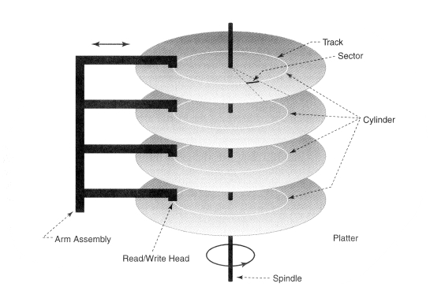

# Periferiche e spazio di IO

Per la macchia virtuale che abbiamo (QEMU) abbiamo delle periferiche dello standard ISA simulate; in particolare abbiamo la tastiera (PC AT), Video (standard VGA), timer (PC AT), HardDisk (PC AT quando inserito)

Analizziamo queste periferiche:

## La Tastiera

Rileva i tasti premuti e rilasciati per comunicarli al pc.

A quasi ogni tasto vi è associato un codice di scansione che si divide in make e brake code (premo e rilascio); dopo un determinato lasso di tempo, se tenuto continuamente premuto, viene interpretata come una sequenza di caratteri uguali.

### Come è fatta fisicamente

All'interno la tastiera è composta da 3 fogli di plastica, dove il foglio più in alto ha tracce verticali, il foglio più in basso tracce orizzontali, mentre il foglio centrale è bucato in corrispondenza dei tasti.

Quando premiamo un tasto, un pulsantino comprime i fogli e mette in conduzione un traccia orizzontale e una verticale.

Collegato alle tracce (sia verticali che orrizontali) si trova un microcontrollore (ROM e piccolo chip con processore e RAM). Il microcontrollore invia migliaia di impulsi al secondo sulle tracce di uno dei due fogli

Se non ci sono pulsanti premuti non ha segnale di ritorno, altrimenti lo ha in corrispondenza della traccia incolonnata.

A questo punto aggiornerà la RAM con la chiave selezionata e manderà segnale di pressione/sollevamento a seconda che la chiave sia stata aggiunta o rimossa.

Sulla scheda madre si trova un’ulteriore microcontrollore con 4 registri (RBR, TBR, STR, CMD). Il segnale in entrata salva l’ultimo codice di scansione in RBR aggiornando opportunamente il registro di stato STR.

È possibile comunicare alla tastiera diverse informazioni, alcune delle quali sono: typemeter (ogni quanto leggo un nuovo codice) ed eventuali led della tastiera.
Il software si occupa di convertire i codici di scansione inviati dalla tastiera in codice ASCII:

## Il video

Per come lo studieremo noi, avremo a che fare con la tecnologia vga, più semplice da comprendere; questo avrà una sua memoria (memoria video) a cui possiamo accedervi normalmente

Questa memoria può essere più o meno grande, ma in qualsiasi caso abbastanza da poter contenere tutta la pagina mostrata a schermo.

La memoria video è particolare dal punto di vista hardware, poiché ha 2 porte di accesso (invece di una sola come la RAM):

- 1 verso la CPU (identica alla RAM)
- 1 verso l’adattatore video

L’adattatore video può leggere tutta la memoria, e lo fa un numero diverso di volte al secondo (30, 60, 90, 120, …).

La teconologia VGA permette l’interpretazione da parte dell’adattatore della memoria in due modi:

Modalità Testo e Modalità Video, andiamo a vedere come funzionano.

### Modalità testo

è la modalità base in cui si accende il calcolatore; memoria e display vengono trattati come caratteri ASCII; l'adattatore ha per questo una sua memoria ROM che associa ad ogni codice ASCII un font che verrà mostrato in video.

In memoria però il carattere non viene definito solo dal codice Ascii ma anche da degli attributi, in paricolare:

Per noi la memoria video parte dal'indirizzo `0xB8000`

### modalità grafica

Il progammatore può accedervi al pixel per modificarne il colore; la modalità più semplice per l’utilizzo è quella tramite frame-buffer, nella quale si può decidere il colore di ogni pixel nell’indirizzo corretto inserendo il colore su 8bit (così da avere una matrice di byte).

Il passaggio tra modalità è estremamente complesso e quello che vedremo noi è semplificato dalla virtualizzazione della macchina.

Tolto questo accorgimento, la modalità gradica funziona in maniera analoga alla modalità testo.

Nelle moderne schede video si trova inoltre un coprocessore grafico, che si occupa escusivamente di fare i disegni in parallelo al processore che esegue altre operazioni. Nel nostro caso non utilizzeremo il coprocessore ma faremo tutto da software.

## Timer

Interfaccia utile per contare il tempo passato, viene implementata tramite un'interfaccia più generale che conta degli eventi (gli impulsi elettrici); in particolare quello che usiamo noi ha 3 interfacce di conteggio:

|N. Contatore|A cosa serve|
|----|----|
|Contatore 0|per le interruzioni|
|Contatore 1|usato per fare refresh della RAM, oggi in disuso|
|Contatore 2|collegato al dispositivo audio del pc|

Ogni contatore ha 4 registri (2 di sola lettura [dello stato corrente del contatore STR_LSB e STR_MSB], 2 di sola scrittura [per impostare parte alta e parte bassa del contatore CTR_LSB E CTR_MSB]), inoltre i tre contatori hanno un registro a comune (CWR)

Il chip occupa gli indirizzi 0x40-0x43 (ha solo 2 piedini), 0x40  per tutto il contatore 0, 0x41 per il contatore 1 e 0x42 per il contatore 2, mentre 0x43 è per CWR

Iniziamo analizzando il Contatore 2

È importante intanto dire che il contatore non è collegato direttamente allo speaker ma prima passa una porta AND con il registro SPR all’indirizzo 0x61. Questa struttura permetteva il mute qual’ora venisse inserito 0 all’intenro di SPR, oltre a poter fare dei giochetti particolari con l’audio.

## Hard disk

è una memoria di massa; il processore (per incompatibilità nelle interfacce) non può eseguire i programmi presenti lì dentro.

Gli hard disk operano a blocchi (tendenzialmente 512Byte), e possono trasferire solo multipli del blocco. La comunicazione viene comunque effettuata tramita un’interfaccia con il bus, che deve essere gestita da software.

Quelli che studiamo noi sono gli HDD, che sono formati da diversi dischi di materiale ferromagnetico che girano costantemente ad una certa velocità (rpm) e che vegono letti da una testina estesa da un braccio che si muove ruotando attorno ad un perno. Le informazioni possono essere salvate su entrambe le facce di un disco. L’insieme di queste parti si chiama drive.

C'è poi una seconda parte detta controllore che si occupa della logica che pilota il drive in base a ciò che viene richiesto dal software

L’informazione su questi dischi è organizzata in settori (spicchi) e tracce (corridoi concentrici). L’intersezione tra un settore e una traccia si dice blocco.

Nella lettura la testina recupera un blocco e lo invia all’interfaccia. Successivamente tramite software verrà recuperato. Nella scrittura si scrive via software su un blocco che poi verrà trasmesso alla traccia e successivamente salvato nel blocco desiderato nei dischi.

Per poter stimare il tempo per una lettura/scrittura dobbiamo considerare tre parametri:

- Seek: è il tempo che ci mette la testina ad arrivare ad una certa posizione $(\in O(ms))$
- Latency: è il tempo che ci mette un settore ad arrivare a portata della testina $(\in O(ms))$
- r/w time: è il tempo necessario per leggere in maniera corretta e completa un blocco. $(\in O(\micro s))$

L’ultimo tempo nella storia recente è migliorato significatamente. All’inizio la testina veniva fatta fluttuare sui dischi e, in caso di assenza di corrente, l’energia prodotta dalla rotazione del disco veniva utilizzata per far spostare in posizione di riposo e non graffiare il disco la testina. Oggi vengono usati dei fermi sulla testina, così da permettere di avvicinarla, riducendo in maniera significativa il tmepo di lettura/scrittura.

Ulteriori parametri da considerare per determinare la velocità di un accesso sono la geometria e la formattazione del disco. Infatti nei blocchi più esterni la lettura è più rapida ma presenta anche più byte sprecati.

Le locazioni non vengono utilizzate dal programmatore con il loro vero numero, bensì viene creata dall’interfaccia un’array di blocchi chiamato LBA (Logical Block Address) che non fa testo sulle posizioni reali dei blocchi ma crea come una hashmap che non comunica all’utilizzatore.

### Come ci si interagisce

Essendo una periferica noi ci si interagisce tramite un'interfaccia che a sua volta comunica con il controllore dell'hardisk.
In particolare ci interessano alcuni registri dell'interfaccia(tutti ad 8bit tranne uno che è a 16 bit):

- SNR (Sector Number), CNL (Cylinder Number Low), CNH (Cylinder Number High), HND (Head aNd Drive): tutti da 8 bit, permettono di specificare il (primo) settore coinvolto nell’operazione;
- SCR (Sector Counter, 8 bit): permette di specificare quanti settori (in sequenza a partire dal primo) sono coinvolti nell’operazione;
- CMD (CoMmanD, 8 bit): permette di specificare il tipo di operazione (per es., lettura o scrittura);
- BR (Buffer Register, 16 bit): permette di accedere al buffer interno, due byte alla volta;
- STS (STatuS, 8 bit): contiene due flag che permettono di sapere se la precedente  operazione si è conclusa (e dunque è possibile accedere al registro BR);

Da questo si capisce che l'individuare tramite le tre coordinate (testina, settore, traccia) ad esso ha solo interesse storico; ad oggi usiamo l'indirizzamento LBA; in particolare questo indirizzo viene calcolato tramite la composizione dei valori dei registri SNR, CNL, CNH e nei 4 bit meno significativi di HND.

Facendo i conti, per identificare i settori si hanno a disposizione 28 bit, ogni settore è di 512 byte, in totale la dimensione massima di questi hard disk è quindi $2^37$ che sono 128GiB
