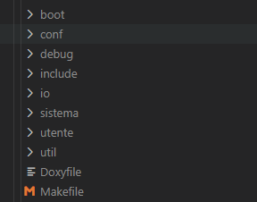

# Sistemi Multiprocesso

Sono sistemi che eseguono più programmi contemporaneamente, vediamo come funziona.

## I processi

è un programma in esecuzione su dei dati di ingresso.\
Questa esecuzione la possiamo modellare come la sequenza degli stati attraverso il cui il sistema processore+memoria passa eseguendo il programma.

Questa definizione si applica bene ai programmi di tipo batch, in cui gli ingressi vengono specificati tutti all’inizio, e il processo prosegue indisturbato dino ad ottenere le uscite. Tuttavia non è difficile immaginarsi l’estensione di questa definizione ai programmi “interattivi”.

L’importante è capire che programma e processo sono due cose completamente distinte, infatti:

Uno stesso programma può essere associato a più processi; ma allo stesso tempo
uno stesso processo può eseguire, in sequenza, più programmi.\
In generale non è esclusivamente il programma a decidere attraverso quali stati il processo dovrà passare, ma hanno influenze anche i vari segnali di input.\
Il programma potrebbe contenere dei cicli, che scrivono le cose da ripetere una sola volta, mentre nel processo vediamo le azioni ripetute tante volte.

A questo punto ritorna comodo il concetto di __contesto__: in un sistema multiprocesso il significato di un'istruzione dipende dal processo che l'ha chiamato:

Se un processo `P1` esegue una istruzione `MOV %rax, 1000` si sta riferendo al “suo” registro `%rax` e al “suo” indirizzo `1000`.\
Mentre se la esegue un processo `P2` parlerà di un diverso `%rax` e di un diverso contenuto dell’indirizzo `1000`.

Il __contesto di un processo__ comprenderà quindi:

- Tutta la memoria (`M2`) usata dal processo. Qualora il processo non fosse in esecuzione, la immaginiamo per ora salvata nell’`HD`
- Una copia privata di tutti i registri del processore, salvati in una opportuna struttura dati.

Per cambiare il contesto quando passiamo da un processo all’altro (ovvero quando eseguiamo swap-out e swap-in della memoria) utilizziamo _tecniche sofware_:

>Ogni volta che si effettua un cambio di processo, andiamo a salvare in una struttura dati i valori dei registri e della memoria del processo terminato.\
>Successivamente copiamo i valori precedentemente salvati nella struttura dati associata al nuovo processo, rendendolo il processo corrente (o processo attivo)

Il software, in `M1`, che fa queste cose è `kernel`.

## Kernel

Il kernel è quindi un software che sta sempre nello spazio di memoria di sistema (`M1`) e può riacquisire occasionalmente il controllo del flusso. Dato che gira a livello sistema può recuperare il controllo del flusso <u>solamente</u> tramite i gate della IDT (interruzioni esterne, eccezioni, chiamate int)

Il registro RIP del processore si trova sempre in uno e uno solo dei processi. L'unico modo in cui RIP cambia è se avviene un cambio di processo effettuato dal kernel stesso.

Il kernel ha diversi modi per decidere come saltare tra processi, noi ne vedremo uno in questo corso, mentre gli altri verranno esaminati nel corso di Sistemi Operativi.

Un’altra scelta che il kernel deve eseguire è quella di decidere la intravisibilità dei processi, ovvero se si possono interfacciare tra di loro o se sono indipendenti. In questo corso vedremo un’implementazione mista dove ci sarà sia una parte della memoria condivisa sia una parte privata.

L’ultima precisazione da fare è che generalemnte tanti processi si riferiscono a diversi programmi, spesso persino di diversi utenti. Noi vedremo invece esclusivamente l’implementazione di un unico programma, di un unico utente, che genera tanti processi.

## Come funziona il nostro sistema

Il sistema che realizzeremo è organizzato in tre moduli:

sistema -- io -- utente\
Ogni modulo è un programma a sé stante, non collegato con gli altri due.

Il modulo sistema contiene la realizzazione dei processi, inclusa la gestione della memoria (tramite memoria virtuale). 

Il modulo io contiene le routine di ingresso/uscita che permettono di utilizzare le periferiche collegate al sistema (testiera, video, hd, …)

Entrambi questi due moduli vengono eseguiti con il processore **a livello sistema**, in un contesto privilegiato, mentre utente verrà eseguito al livello utente.

Il ruolo di sistema e io è quello di <u>fornire un supporto </u>ad utente, sotto forma di primitive che possono essere da lui invocate. In particolare utente può creare più processi che vengono eseguiti concorrentemente.

Il nostro sistema si sviluppa quindi nella directory `nucleo-8.3/`. (versione utilizzata durante la stesura di questi appunti) Al suo interno troviamo le seguenti sottodirectory:

- sistema/, io/ e utente/, che contengono i file sorgenti dei rispettivi moduli;
- util/, che contiene alcuni script di utilità;
- include/, che contiene dei file .h inclusi dai vari sorgenti;
- build/, inizialmente vuota, destinata a contenere i moduli finiti;
- debug/, che contiene alcune estensioni per il debugger gdb;
- doc/, destinata a contenere la documentazione dei moduli.
  
Oltre a queste sottodirectory troviamo anche due file:

- MakeFile: contiene le istruzioni per il programma make del sistema di appoggio.
- run: uno script che permette di avviare il sistema su una VM

Il MakeFile può essere utilizzato per generare la documentazione (se sono installati Doxygen, Pandoc e Graphviz) lanciando il comando `make doc`

Se ha successo si troverà nell’indice doc/html/index.html.

Per compilare tutti i moduli si utilizza, nella directory nucleo-8.3 il comando make. Questo comando può prendere alcuni parametri:

``` cpp
make clean    # Elimina tutti i file oggetto creati
make reset    # Elimina tutti i file oggetto e i moduli creati
```



### come funzionano i 3 main moduli

Il contenuto del modulo `sistema` e del modulo `io` costituiscono il vero sistema (ovvero cambia raramente), mentre il modulo `utente` contiene solo il programma da far girare nel nostro sistema (nella _sottodirectory_ `examples/` ci sono -appunto- esempi)

## Come si avvia il sistema

paradossalmente basta fare il comando `boot` sul terminale che implicitamente (come anche fa nativamente intel) si avvia in 16 bit, passa in modalità protetta a 32 bit -col programma di bootstrap; successivamente noi portiamo il processore alla modalità a 64 bit tramite l'utilizzo del programma boot.bin.

Quando avviamo il boot sul nostro terminale vediamo però una serie di messaggi legati a boot.bin, al modulo sistema ed al modulo io.

*copiare terminale + spiegazione*

Il sistema sul quale lavoriamo è progettato affinché qualsiasi eccezione venga sollevata in modalità utente, resituisce il controllo al modulo sistema, il quale termina forzatamente il processo e invia alcuni messaggi sul log come il seguente:

``` cpp
1 | [WRN] 5 Eccezione 13 (errore di protezione), errore 0, RIP inputb [inputb.s:6]
 2 | [WRN] 5 proc 5: corpo start [utente.s:10](0), livello UTENTE, precedenza 1023
 3 | [WRN] 5 RIP=inputb [inputb.s:6] CPL=LIV_UTENTE
 4 | [WRN] 5 RFLAGS=246 [-- -- -- IF -- -- ZF -- PF --, IOPL=SISTEMA]
 5 | [WRN] 5 RAX= fee000b0 RBX= 0 RCX=fffffffffffffe68 RDX= 60
 6 | [WRN] 5 RDI= 60 RSI=fffffffffffffe68 RBP=fffffffffffffff0 RSP=ffffffffffffffe8
 7 | [WRN] 5 R8 =ffff800000106068 R9 = 0 R10= 0 R11= 0
 8 | [WRN] 5 R12= 0 R13= 0 R14= 0 R15= 0
 9 | [WRN] 5 backtrace:
10 | [WRN] 5 > main [utente.cpp:5]
11 | [WRN] 5 Processo 5 abortito
```

Questi messaggi hanno una struttura generalmente simile tra di loro.

Alla riga 1 viene indicata:

il tipo di eccezione che ha generato lo shutdown del processo Eccezione 13 (errore di protezione)
Una descrizione dell’errore errore 0
L’istruzione che l’ha sollevata RIP inputb [inputb.b:6]
Nella seconda riga si hanno informazioni riguardanti il processo interrotto e il livello al quale l’eccezione è stata sollevata livello UTENTE, precedenza 1023

Successivamente nelle righe 3-8 è presente un riepilogo dello stato dei registri al momento dell’eccezione, utile per il debug.

Dalla riga 9 fino alla penultima si ha un backtrace delle chiamate che indica come siamo arrivati al file corrrente, in questo caso passando dal main nel file utente.cpp:5

L’ultima riga indica l’esito del processo, nel nostro caso sempre abortito.

Tutte queste informazioni che ci vengono fornite, sono processate dallo script util/show_log.pl a partire dal log inviato dal sistema che contiene solamente indirizzi numerici, usando le informazioni di debug contenute nei file della directory build/. Nel caso si voglia vedere il contenuto del log non processato si può usare il comando:

CERAW=1 boot

## Uso del debugger

Anche per quanto riguarda il debug, così come per gli esempiIO, abbiamo la possibilità di collegare il debugger dalla macchina host e osservare tutto quello che accade nel sistema.

La procedura è quella già vista:

Avviamo la VM tramite boot -g
Da un altro terminale, ci portiamo nella stessa directory e lanciamo il comando debug.
In questo caso però lo script, oltre alle estensioni già viste, carica altre estensioni dal file debug/nucleo.py, in modo che il debugger mostri informazioni specifiche sullo stato del nucleo.

In particolare, ogni volta che il debugger riacquisisce il controllo, viene mostrato:

Lo stack delle chiamate (backtrace);
Il file sorgente nell’intorno del punto in cui si trova %rip;
Se il sorgente è C++, i parametri della funzione in cui ci troviamo e tutte le sue variabili locali; Altrimenti se il file è assembler vengono mostrati i registri e la parte superiore della pila;
Il numero di processi (utente) esistenti e le liste esecuzione e pronti (ed eventuali altre liste di processi);
Alcuni dettagli sul processo attualmente in esecuzione;
Lo stato di protezione della CPU.
Oltre ai normali comandi di gdb, sono disponibili altri comandi personalizzati per il nostro nucleo. Alcuni di quesi comandi sono:

process list: mostra una lista di tutti i processi attivi (utente o sistema);
process dump id: mostra il contenuto (della parte superiore) della pila sistema del processo id e il contenuto dell’array contesto del suo descrittore di processo.
Altri comandi disponibili servono ad esaminare altre strutture dati che per il momento non abbiamo ancora introdotto.

Possiamo notare inoltre che il debugger è preimpostato per caricare i simboli di tutti e tre i moduli. È quindi possibile inserire breakpoint liberamente nel codice del modulo sistema, utente e io.